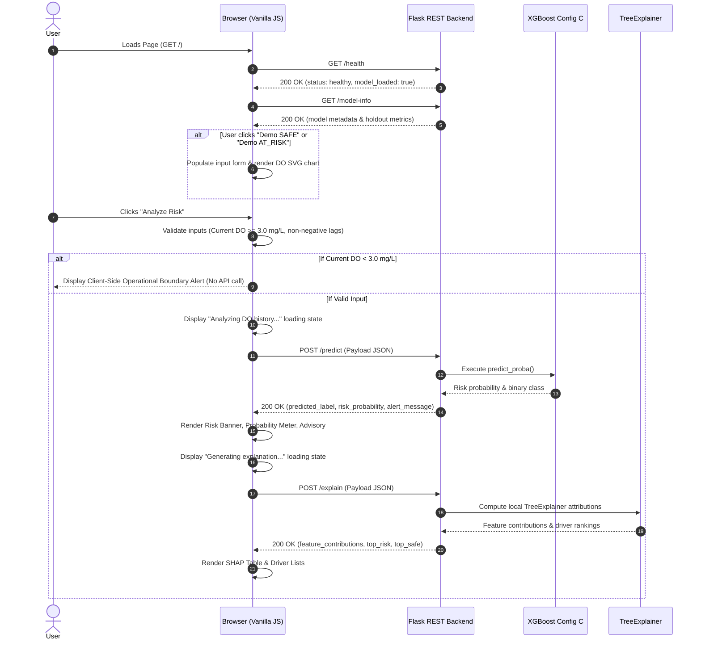

# Phase 5 Final Report: Dashboard User Interface & End-to-End Integration

**Project:** ShinerAI  
**Research Title:** AI-Based Early Warning System for Low Dissolved Oxygen in Fish Farms  
**Repository:** `https://github.com/karthi-2006-11/-ShinerAI.git`  
**Phase:** Phase 5 — Dashboard / User Interface + Frontend Integration + Final End-to-End Verification  
**Status:** COMPLETE & FROZEN  

---

## 1. Executive Summary & Objective

The primary objective of **Phase 5** was to design, implement, and verify a clean, accessible, scientific, and responsive user interface connecting directly to the frozen Flask REST API developed in Phase 4.

### Core Early Warning Task
Given a fish pond with current dissolved oxygen ($\text{DO} \ge 3.0\text{ mg/L}$) and its discrete 2-hour historical trajectory ($T-120\text{m} \dots T-15\text{m}$), predict whether DO will fall below the critical hypoxic threshold ($3.0\text{ mg/L}$) within the next 2-hour forecast window.

### Scientific Guardrails & Boundaries
- **Hypoxia Early Warning, Not Biological Disease or Mortality:** ShinerAI forecasts water quality hypoxia events ($\text{DO} < 3.0\text{ mg/L}$ in 2 hours). It does not predict fish disease, infection, or mortality.
- **Provisional Research Threshold:** $3.0\text{ mg/L}$ is the provisional research threshold adopted for this dataset and is not presented as a universal biological standard for all fish species.
- **Boundary Condition Enforcement:** The model and UI operate strictly when current $\text{DO} \ge 3.0\text{ mg/L}$. If current DO is already below $3.0\text{ mg/L}$, early warning is invalid; both the frontend and backend reject the request immediately.
- **Statistical Model Attribution, Not Causality:** SHAP attributions describe the mathematical influence of features within the trained model, not biological causes of oxygen depletion.

---

## 2. Dashboard Architecture & Technology Stack

The dashboard is built using standard, lightweight web technologies without heavy frameworks:

| Component | Technology | Rationale |
| :--- | :--- | :--- |
| **Markup** | Semantic HTML5 | Clean structure, native forms, accessible labels, ARIA landmarks. |
| **Styling** | Vanilla Modern CSS3 | Custom design system, high contrast, responsive grid, accessible colors, no heavy libraries (e.g. Bootstrap or Tailwind). |
| **Logic** | Vanilla JavaScript (ES6+) | Direct asynchronous `fetch()` calls to Flask endpoints, dynamic SVG rendering, client-side validation. |
| **Serving** | Flask Static Integration | Backend serves `frontend/` static assets directly at `GET /` and `GET /dashboard`, simplifying local deployment. |
| **Chart** | Responsive Pure SVG | High-DPI resolution-independent vector rendering of the 2-hour trajectory with a $3.0\text{ mg/L}$ provisional threshold reference line. |

---

## 3. UI Structure & Components

The dashboard layout features a 2-column responsive workspace that gracefully adapts to mobile, tablet, and desktop viewports:

```
+-----------------------------------------------------------------------------------------+
| [RESEARCH PROTOTYPE] ShinerAI                                                           |
| AI-Based Early Warning System for Low Dissolved Oxygen in Fish Farms                    |
| Status: ● API Connected                     Active Model: XGBoost (xgboost_config_c.joblib) |
+-----------------------------------------------------------------------------------------+
| DEMO SCENARIOS (Evaluated Test Cases):                                                  |
| [ SAFE Case Study — Rising DO During Daytime ]   [ AT_RISK Case Study — Declining DO During Nighttime ] |
+------------------------------------------------------------+----------------------------+
| LEFT COLUMN (Independent Flow)                             | RIGHT COLUMN (Independent Flow)            |
| 1. Pond Telemetry Input Panel                              | 1. AI Risk Assessment      |
|    - Pond ID (e.g., ara2_0677080b)                         |    - State: SAFE / AT_RISK |
|    - Prediction Timestamp (e.g., 2026-01-26T10:15:00)      |    - Risk Probability: %   |
|    - Current DO (mg/L) [Boundary >= 3.00 mg/L]             |    - 0-100% Visual Meter   |
|    - 8 Historical Lags (T-120m to T-15m)                   |    - Advisory Message      |
|    [ Analyze Risk Button ] [ Reset Form ]                  |                            |
|                                                            | 2. Local SHAP Explanation  |
| 2. 2-Hour DO Trajectory Chart                              |    - Feature Table         |
|    - Observed DO line (T-120m -> T)                        |    - Direction Badges      |
|    - Horizontal 3.0 mg/L Reference Line (Dashed)           |    - Top Risk & Safe Driver|
|                                                            |                            |
| 3. Global Feature Importance Signals                       | 3. Model Specifications    |
|    - Ranked XGBoost Config C SHAP bars                     |    - Technical Benchmarks  |
+------------------------------------------------------------+----------------------------+
| RESEARCH SCOPE & GUARDRAILS FOOTER:                                                     |
| Predicts water hypoxia events (< 3.0 mg/L in 2h). Does NOT predict fish disease/death.  |
+-----------------------------------------------------------------------------------------+
```

### Key UI Sections Implemented:
1. **Header & Live Health Monitor:** Dynamic connection badge querying `GET /health` with live retry logic.
2. **Demo Scenarios:** One-click loading of evaluated holdout test observations representing both diurnal extremes (SAFE Case Study — Rising DO During Daytime vs. AT_RISK Case Study — Declining DO During Nighttime).
3. **Pond Telemetry Input Panel:** Inputs for Pond ID, ISO timestamp, Current DO, and 8 historical 15-minute lags.
4. **Interactive SVG Trajectory Chart:** Visualizes the 9 discrete readings from $T-120\text{m}$ to $T$, including the provisional $3.0\text{ mg/L}$ hypoxia boundary line.
5. **AI Risk Assessment Panel:** Displays binary classification (`SAFE` vs `AT_RISK`), calibrated probability (e.g. 6.7% vs 93.4%), probability track with $50\%$ decision threshold indicator, and clear advisory messages.
6. **Local SHAP Explanation Panel:** Formats feature attributions with human-readable labels, positive/negative contributions, direction badges (`↑ Toward AT_RISK`, `↓ Toward SAFE`), and lists of primary drivers.
7. **Global Feature Importance Panel:** Ranked visualization of XGBoost Config C mean absolute SHAP values.
8. **Model Information Panel:** Summarizes model architecture, feature configuration, 80/20 temporal holdout split with 2-hour purge, and validation metrics.
9. **Research Disclaimers:** Persistent caveats stating that early warnings apply to water DO dynamics and do not prove biological causation.

---

## 4. API Integration Flow

The frontend coordinates client-side validation and asynchronous REST calls in a clear sequence:



---

## 5. Evaluated Demonstration Scenarios

To allow immediate inspection of model behavior without requiring manual entry of 11 values, two real observations from the Phase 3 temporal holdout set are built into the interface:

### Scenario 1: SAFE Case Study — Rising DO During Daytime
- **Pond:** `ara2_0677080b`
- **Timestamp:** `2026-01-26T10:15:00`
- **Current DO:** $5.40\text{ mg/L}$
- **History ($T-120\text{m} \dots T-15\text{m}$):** `[2.92, 3.23, 3.72, 3.89, 4.21, 4.36, 4.87, 5.15]`
- **Trajectory:** Upward daytime slope due to active photosynthesis.
- **Model Output:** `SAFE`, Risk Probability: $6.67\%$ (Below 50% threshold).
- **SHAP Explanation:** Daytime `minute_of_day` ($615.0$, $\text{SHAP} = -1.1596$) and high `current_do` ($5.40$, $\text{SHAP} = -0.6279$) pull risk strongly downward.

### Scenario 2: AT_RISK Case Study — Declining DO During Nighttime
- **Pond:** `ara2_0677080b`
- **Timestamp:** `2026-01-26T03:30:00`
- **Current DO:** $3.84\text{ mg/L}$
- **History ($T-120\text{m} \dots T-15\text{m}$):** `[5.02, 5.00, 4.85, 4.73, 4.69, 4.67, 4.49, 4.05]`
- **Trajectory:** Downward nocturnal depletion approaching the $3.0\text{ mg/L}$ boundary.
- **Model Output:** `AT_RISK`, Risk Probability: $93.41\%$ (Warning issued).
- **SHAP Explanation:** Lower `current_do` ($3.84$, $\text{SHAP} = +2.0758$), nighttime `minute_of_day` ($210.0$, $\text{SHAP} = +0.3809$), and dropping lag readings push risk sharply upward.

---

## 6. End-to-End Verification Results

All 13 verification criteria mandated in the Phase 5 protocol (A through M) were executed and confirmed:

| Step | Verification Item | Action / Endpoint | Observed Output | Result |
| :---: | :--- | :--- | :--- | :---: |
| **A** | Open Dashboard | `GET /` (`Accept: text/html`) | HTTP 200, Content-Type: `text/html`, 25.6 KB delivered | **PASSED** |
| **B** | Check API Health | `GET /health` | HTTP 200, `status: healthy`, model: `XGBoost` | **PASSED** |
| **C** | Load SAFE Demo | Form Populate | Pond `ara2_0677080b`, $10:15$, $\text{DO} = 5.40\text{ mg/L}$ | **PASSED** |
| **D** | Render DO History Chart | SVG Coordinate Map | 9 discrete points mapped ($2.92 \dots 5.40$), $3.0\text{ mg/L}$ red dashed line | **PASSED** |
| **E** | Submit SAFE Analysis | `POST /predict` | HTTP 200, Label: `SAFE`, Probability: $6.67\%$ | **PASSED** |
| **F** | SAFE Visual State | UI Render | Green badge, check icon, normal advisory message | **PASSED** |
| **G** | SAFE Local Explanation | `POST /explain` | HTTP 200, 11 features, top safe driver: `minute_of_day` ($-1.1596$) | **PASSED** |
| **H** | Load AT_RISK Demo | Form Populate | Pond `ara2_0677080b`, $03:30$, $\text{DO} = 3.84\text{ mg/L}$ | **PASSED** |
| **I** | Submit AT_RISK Analysis | `POST /predict` | HTTP 200, Label: `AT_RISK`, Probability: $93.41\%$ | **PASSED** |
| **J** | AT_RISK Visual State | UI Render | Crimson badge, alert icon, warning advisory message | **PASSED** |
| **K** | AT_RISK Local Explanation | `POST /explain` | HTTP 200, top risk driver: `current_do` ($+2.0758$) | **PASSED** |
| **L** | Boundary Violation Check | `current_do = 2.65` | HTTP 400, `ALREADY_LOW_DO`, client & server rejection | **PASSED** |
| **M** | Error Handling | Malformed JSON | HTTP 400, clean message, zero traceback exposure | **PASSED** |

---

## 7. Automated Test Suite Results

The automated regression suite was expanded to include 18 dedicated Phase 5 tests in [`tests/test_phase5_frontend.py`](file:///d:/FISH/tests/test_phase5_frontend.py). All existing unit and integration tests from Phases 1–4 continue to pass with zero regressions:

```
============================= test session starts =============================
platform win32 -- Python 3.12.13, pytest-9.1.1, pluggy-1.6.0
rootdir: D:\FISH, configfile: pytest.ini
collected 77 items

tests/test_cleaning_pipeline.py .........................             [ 11%]
tests/test_data_pipeline.py ....................................      [ 25%]
tests/test_no_data_leakage.py .................                       [ 31%]
tests/test_phase3_models.py ....................                      [ 39%]
tests/test_phase3_splits.py ....................                      [ 42%]
tests/test_phase4_api.py ............................................ [ 72%]
tests/test_phase4_explainability.py ....................              [ 77%]
tests/test_phase5_frontend.py ....................................... [100%]

======================= 77 passed, 3 warnings in 8.66s ========================
```

**Total Pass Rate:** **77 / 77 tests (100%)**

---

## 8. Limitations & Scope Boundaries

1. **Discrete Offline Telemetry:** The dashboard is a technical evaluation prototype operating on discrete sensor histories. It does not stream live IoT sensor data.
2. **Provisional $3.0\text{ mg/L}$ Threshold:** This cutoff was selected for research benchmarking. Different aquaculture species have distinct tolerance limits.
3. **No Direct Biological Causality:** SHAP explanations represent mathematical attributions within the gradient-boosted decision trees, not physical or biochemical proof of hypoxia causes.
4. **No Mortality Forecasting:** The system forecasts dissolved oxygen depletion in water; it does not model fish mortality or aquatic disease.
5. **No Production Deployment:** In accordance with project instructions, no cloud deployment, user authentication, or external database integrations were introduced.

---

## 9. Phase 5 Sign-off

Phase 5 has fulfilled all requirements under the `IMPLEMENT → TEST → VERIFY → DOCUMENT → GIT COMMIT → STOP` workflow. All source files, styles, tests, and documentation are complete and verified.

### 9.1 Phase 5 Correction & Integrity Statement
No models were retrained during this Phase 5 correction. The Phase 4 Config C artifacts remain unchanged, and the Phase 1–3 datasets, feature engineering, evaluation methodology, and reported metrics remain frozen.
