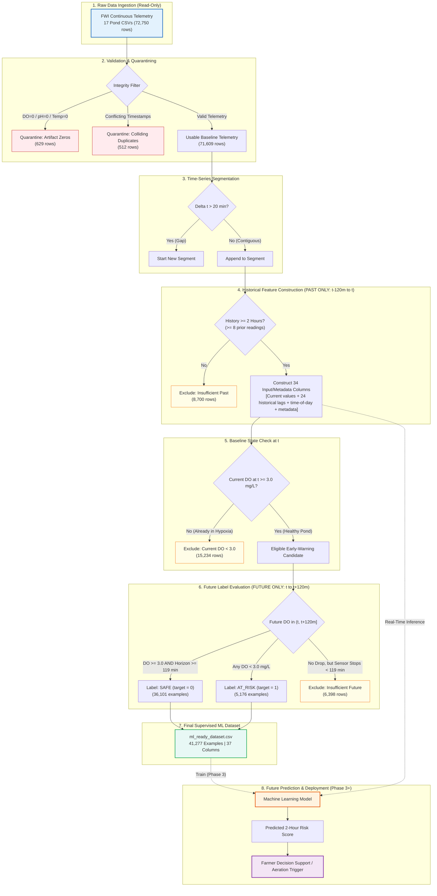

# ShinerAI: Project Documentation

---

## 1. Project Title
**AI-Based Early Warning System for Low Dissolved Oxygen in Fish Farms**

---

## 2. Application Name
**ShinerAI**

---

## 3. Project Overview
**ShinerAI** is an artificial intelligence and machine learning early-warning solution designed for aquaculture and commercial fish farming operations. By processing continuous high-resolution water quality telemetry from in-situ pond sensors, ShinerAI forecasts severe Dissolved Oxygen (DO) depletion up to 2 hours before hypoxia occurs. This advance notice enables aquaculture operators to take targeted preventative actions—such as activating mechanical surface aerators, operating water exchange pumps, or pausing feed distribution—averting aquatic mortality and improving farm resource efficiency.

---

## 4. Problem Statement
In freshwater aquaculture, dissolved oxygen concentration is the single most volatile and life-critical environmental parameter. Under normal biological cycles, aquatic photosynthesis produces oxygen during daylight hours, while microbial decomposition and fish respiration consume oxygen continuously. During the night and early morning hours, dissolved oxygen levels routinely drop to hazardous levels. 

When dissolved oxygen falls below critical biological thresholds, cultured fish experience respiratory distress, cellular hypoxia, suppressed immune function, and rapid mass mortality if emergency aeration is not introduced promptly. Commercial fish farms typically monitor ponds manually or rely on reactive threshold alarms. However, by the time a fixed threshold alarm sounds, dissolved oxygen is already dangerously low, leaving insufficient reaction time for farm workers to deploy equipment or start pumps before fish sustain irreparable biological damage.

---

## 5. Project Objective
The central objective of ShinerAI is to establish a verified, leak-free supervised machine learning framework that formulates and solves the following predictive problem:

$$\text{"Given that pond DO is currently healthy } (\text{DO} \ge 3.0\text{ mg/L}), \text{ will DO fall below } 3.0\text{ mg/L at any point during the next 2 hours?"}$$

By framing early warning as a forward-looking binary classification problem ($0 = \text{SAFE}, 1 = \text{AT\_RISK}$), ShinerAI provides actionable decision support with a 2-hour operational lead time.

---

## 6. Scope
The scope of the current completed work (Phases 1 and 2) encompasses:
- Comprehensive audit of continuous time-series telemetry from 17 commercial aquaculture ponds.
- Rigorous data cleaning, equipment artifact quarantine, and conflicting duplicate isolation.
- Continuous time-series segmentation honoring sensor outages and operational downtime.
- Construction of a leak-free supervised learning dataset with past historical features and forward-looking prediction labels.
- Strict numerical reconciliation accounting for all 72,750 raw observations with zero unexplained rows.
- Complete automated test suite coverage (24/24 unit and integrity tests).

**Explicit Non-Goals for Phases 1 & 2:**
- No machine learning model training or hyperparameter optimization (scheduled for Phase 3).
- No web application, Flask/FastAPI service, or dashboard development.
- No synthetic data generation or arbitrary interpolation across missing time intervals.
- No prediction of general fish diseases, pathogens, or biological mortality beyond water oxygen depletion.

---

## 7. Why This Problem Matters
- **Food Security & Economic Sustainability:** Aquaculture accounts for over 50% of global fish consumed for human nutrition. In smallholder commercial fish farms across developing economies, a single overnight oxygen depletion event can wipe out an entire seasonal crop, causing catastrophic financial ruin for farming families.
- **Energy Optimization:** Continuous aeration using diesel generators or electric paddlewheels accounts for 40%–60% of farm operational overhead. Predictive intelligence enables demand-driven aeration, drastically reducing unnecessary energy expenditure and carbon footprint.
- **Animal Welfare:** Prolonged sub-lethal hypoxia causes chronic stress, poor feed conversion efficiency, stunted growth, and susceptibility to secondary infections, reducing overall animal welfare.

---

## 8. Research Motivation
Aquaculture water quality exhibits complex non-linear dynamics influenced by water temperature, diurnal sunlight patterns, chemical equilibrium (pH), and aquatic biomass respiration. Traditional time-series forecasting models (such as ARIMA) often struggle with sudden drop dynamics or sensor anomalies in harsh outdoor environments. Applying modern supervised machine learning over continuous in-situ sensor telemetry provides the opportunity to detect subtle pre-crisis deterioration signatures (e.g., accelerating rates of DO decline coupled with water temperature shifts) hours before emergency thresholds are breached.

---

## 9. Dataset Source
The primary data source utilized in this project is the **Fish Welfare Initiative (FWI) Continuous Water Quality Monitoring Dataset**, gathered during a field monitoring campaign in commercial aquaculture ponds.
- **Repository Location:** `data/raw/csv/`
- **Data Campaign:** FWI Water Quality Monitoring Campaign in tandem with satellite overpasses.
- **Governance:** Open scientific aquaculture dataset for water quality modeling and welfare improvement.

---

## 10. Dataset Collection Context
- **Geographic Location:** Commercial freshwater aquaculture ponds situated in Eluru, Andhra Pradesh, India.
- **Environment:** Earthen commercial fish ponds cultivating major Indian carp and related commercial species.
- **Sensors Deployed:** In-situ continuous automated multiparameter optical water quality probes suspended in pond water columns, complemented by handheld YSI ProDSS multi-parameter meters and photometers for calibration.
- **Operational Reality:** Real-world field deployment subject to biofouling, battery drains, equipment resets, uninstallation for fish harvesting, and manual pond interventions.

---

## 11. Dataset Structure
The dataset repository comprises 22 total CSV files stored in `data/raw/csv/`:
- **17 Pond Time-Series CSV Files:** Primary continuous telemetry, designated by anonymized pond identifiers `ara2_xxxxxxxx.csv`.
- **5 Supplementary Metadata / Comparison Files:**
  1. `Continuous_Monitor_vs_ProDSS_Comparison.csv`
  2. `Key_Events.csv`
  3. `ProDSS_and_Photometer.csv`
  4. `ProDSS_vs_Continuous_Monitors_Comparison.csv`
  5. `QC_Flags.csv`

---

## 12. Dataset Parameters
Each 15-minute continuous reading in the pond time-series files contains seven standard fields:

| Parameter | Data Type | Units / Format | Description |
|---|---|---|---|
| `Date/Time (IST)` | String / Datetime | `YYYY-MM-DD HH:MM:SS` | Timestamp recorded in Indian Standard Time (UTC+05:30) |
| `DO (mg/L)` | Float | mg/L | Dissolved Oxygen concentration in pond water column |
| `pH` | Float | pH units (0–14) | Acidity / alkalinity measure of pond water |
| `Temp (°C)` | Float | Degrees Celsius (°C) | Water temperature at sensor depth |
| `QC_Flag_DateTime` | String | Categorical Flag | Quality control annotation for timestamp regularities |
| `QC_Flag_DO` | String | Categorical Flag | Quality control annotation for dissolved oxygen readings |
| `QC_Flag_pH` | String | Categorical Flag | Quality control annotation for pH readings |

---

## 13. Dataset Size
- **Total Raw Ingested Observations:** **72,750 rows** across all 17 pond time-series files.
- **Minimum Rows per Pond:** 2,298 rows (`ara2_148f1633`)
- **Maximum Rows per Pond:** 5,592 rows (`ara2_29660d32`)
- **Median Rows per Pond:** 4,436 rows
- **Final ML-Ready Examples:** **41,277 examples** (each representing a full 4-hour temporal span: 2h past + 2h future).

---

## 14. Pond Coverage
All 17 monitored ponds are fully represented in both the raw and the cleaned/ML-ready datasets:
1. `ara2_0677080b`
2. `ara2_0f143c64`
3. `ara2_148f1633`
4. `ara2_176528d3`
5. `ara2_29660d32`
6. `ara2_3b2f3973`
7. `ara2_3eab831e`
8. `ara2_3ed4df8e`
9. `ara2_45e1cde5`
10. `ara2_4f79fc8d`
11. `ara2_573a2826`
12. `ara2_6ca69422`
13. `ara2_858b914c`
14. `ara2_b3d128ac`
15. `ara2_c9cdacda`
16. `ara2_ca187575`
17. `ara2_d52ddb31`

Crucially, **every single one of the 17 ponds contains both SAFE and AT_RISK examples**, guaranteeing that predictive models learn cross-pond hypoxia dynamics rather than pond identity shortcuts.

---

## 15. Date Range
- **Earliest Timestamp:** `2025-11-28 21:30:00 IST` (`ara2_29660d32`)
- **Latest Timestamp:** `2026-01-30 23:45:39 IST` (`ara2_3eab831e`)
- **Total Temporal Span:** **63.09 days** (~9 continuous weeks during the Indian winter season).
- **Deployment Lifecycle:** Staggered across late November to early December 2025, concluding between late December 2025 (harvest uninstallation) and late January 2026.

---

## 16. Sampling Frequency
- **Nominal Interval:** Approximately **15 minutes** between consecutive records.
- **Cadence Adherence:** 97.37% of consecutive timestamps fall within 13.5 to 16.5 minutes ($\Delta t \approx 15 \pm 1.5\text{ min}$).
- **Interval Regularity:** Residual deviations reflect slight microcontroller clock drift ($\pm 10\text{ seconds}$).

---

## 17. Dataset Health / Quality Assessment
The raw telemetry represents authentic commercial field conditions. A systematic audit verified:
- Zero corrupt or unparseable text values in numeric columns.
- All timestamps parseable into chronological sequence.
- 98.43% of observations (71,609 rows) represent physically valid aquatic measurements.
- 1.56% of observations (1,141 rows) contain hardware reset artifacts or conflicting duplicate records, all of which are quarantined.

### Full Dataset Health & Numerical Accounting Table

| Metric | Value | % of Raw Data | Category / Interpretation |
|---|---|---|---|
| **Raw Ingested Observations** | **72,750** | **100.00%** | Total continuous telemetry across 17 ponds |
| **Monitored Ponds** | **17** | **100.00%** | All 17 ponds verified and tracked |
| **Date Range** | **2025-11-28 to 2026-01-30** | — | 63.09 days total duration (~9 weeks) |
| **Sampling Frequency** | **~15 minutes** | 97.37% | Adherence within 13.5–16.5 minute window |
| **Excluded: Sensor Artifacts (Zeros)** | **629** | **0.86%** | Hardware reset/probe disconnect (`DO=0`, `pH=0`, or `Temp=0`) |
| **Excluded: Conflicting Duplicates** | **512** | **0.70%** | Unresolvable timestamp collisions with conflicting values |
| *Usable Baseline Observations* | *71,609* | *98.43%* | Valid unique readings eligible for temporal sequence windowing |
| **Excluded: Current DO < 3.0 mg/L** | **15,234** | **20.94%** | Pond already in oxygen crisis at time $T$; non-candidate for early warning |
| **Excluded: Insufficient Past History** | **8,700** | **11.96%** | Fewer than 8 prior readings in contiguous segment ($< 2$h history) |
| **Excluded: Insufficient Future Coverage** | **6,398** | **8.79%** | Sensor stopped before $T+120\text{m}$ without low DO; prevents false SAFE |
| **Final ML-Ready: SAFE (`target=0`)** | **36,101** | **49.62%** | DO remains strictly $\ge 3.0$ mg/L across complete 2h future window |
| **Final ML-Ready: AT_RISK (`target=1`)** | **5,176** | **7.11%** | DO observed dropping $< 3.0$ mg/L within 2h future window |
| **Final ML-Ready Total Examples** | **41,277** | **56.74%** | Total supervised learning rows in `ml_ready_dataset.csv` |
| **SAFE Percentage (ML Dataset)** | **87.46%** | — | Safe examples in ML-ready dataset |
| **AT_RISK Percentage (ML Dataset)** | **12.54%** | — | At-risk examples in ML-ready dataset |
| **Class Imbalance Ratio** | **6.97 : 1** | — | Moderately imbalanced class distribution |
| **ML-Ready Columns** | **37** | — | 34 input/metadata columns. The actual model predictors will be selected during Phase 3. (+ 3 target/quality columns) |
| **Automated Tests Passing** | **24 / 24** | **100%** | `pytest -v` across data, cleaning, and leakage test suites |
| **Label Validation Checks** | **40 / 40** | **100%** | 20 SAFE + 20 AT_RISK random samples independently verified |
| **Leakage Audit Status** | **PASS (0 violations)** | — | Zero future-reading exposure in past input features |
| **Unexplained Rows** | **0** | **0.00%** | Strict mathematical identity verified |

---

## 18. Missing Values
- **Within-Row Missingness:** Zero null or NaN values exist in the raw continuous monitoring columns (`DO`, `pH`, `Temp`). Every raw row contains a populated reading or an artifact code.
- **Between-Row Missingness (Temporal Gaps):** Missingness manifests primarily as temporal intervals $> 20$ minutes where sensors were unpowered, uninstalled, or cleaning was performed. These gaps are handled via explicit segment partitioning rather than numerical imputation.

---

## 19. Duplicate Records
Timestamp collisions occurred in two ponds:
- `ara2_3ed4df8e`: 444 total records participating in collisions.
- `ara2_6ca69422`: 68 total records participating in collisions.
- **Total Colliding Records:** **512 rows**.

### Methodological Resolution of Duplicate Count Discrepancy:
- **Phase 1 Method (`keep='first'`):** Counted 258 excess rows to drop ($224 + 34$).
- **Phase 2 Method (`keep=False`):** Identified all 512 rows participating in timestamp collisions ($444 + 68$).
- **Cleaning Decision:** Because colliding rows contained conflicting sensor telemetry (e.g., simultaneous readings of $2.16\text{ mg/L}$ and $2.57\text{ mg/L}$), picking one arbitrarily would introduce ungrounded noise. Therefore, all 512 colliding records are quarantined under `data_quality_status = 'excluded_duplicate'`.

---

## 20. Sensor Artifacts
In electronic water quality monitoring, sudden exact zero readings (`DO == 0.0`, `pH == 0.0`, `Temp == 0.0`) are characteristic signatures of hardware reboot cycles, power interruptions, or electrical disconnects:
- **Total Quarantined Sensor Artifacts:** **629 rows** (0.86% of raw telemetry).
- **Physical Justification:** Commercial aquaculture ponds in tropical India never achieve natural water temperatures of 0.0°C or genuine chemical pH of 0.0. These values are non-biological artifacts and are quarantined from analysis.

---

## 21. Time Gaps
Across the 17 ponds, 1,061 sampling gaps $> 20$ minutes were identified:
- **Operational Gaps:** Minor gaps (20 to 60 minutes) caused by sensor cleaning, probe recalibration, or battery swaps.
- **Multi-Day Gaps:** Extended gaps lasting from 1 to 21 days due to sensor maintenance, farm operational pauses, or probe redeployment.
- **Handling Principle:** Time series are never artificially stitched across gaps $> 20$ minutes. Each gap terminates the current segment and begins a new contiguous segment.

---

## 22. QC Flags
The original dataset author annotations (`QC_Flag_DateTime`, `QC_Flag_DO`, `QC_Flag_pH`) were audited:
- 71.8% of DO readings were flagged with `acceptable` or no flag.
- Common flags included `DO_abnormal` (readings outside typical bounds), `DO_jump_>2` (sudden physiological shifts), and `time_gap_>20min`.
- In Phase 2, automated cleaning was established on objective physical rules (exact zeros, timestamp collisions, gap thresholds), utilizing QC flags as informative validation indicators.

---

## 23. Cleaning Methodology
The data cleaning pipeline ([`src/cleaning.py`](file:///d:/FISH/src/cleaning.py)) operates strictly as a deterministic multi-stage filter:
1. **Raw Verification:** Confirm read-only raw files, verify schema integrity, parse datetime strings to `pd.Timestamp`.
2. **Quarantine Filtering:** Flag exact zeros and conflicting duplicates, assigning explicit status strings in `cleaned_pond_data.csv`.
3. **Chronological Sorting:** Enforce strict time ordering within each pond.
4. **Contiguous Segmentation:** Increment `segment_id` whenever $\Delta t > 20\text{ minutes}$.
5. **Window Evaluation:** Generate candidate time points $T$ and evaluate past history and future horizons strictly within the same contiguous segment.

---

## 24. Raw-to-Processed Data Flow



> **Architecture Diagram Image:** A high-resolution export of the pipeline architecture is saved at [`results/figures/data_flow_diagram.png`](file:///d:/FISH/results/figures/data_flow_diagram.png).

---

## 25. Prediction Problem Definition
ShinerAI frames early warning as an advance binary classification task:
- **Prediction Timestamp ($T$):** The current moment at which the farm monitoring system evaluates pond conditions.
- **Historical Input Window:** The preceding 2-hour historical segment $[T - 120\text{ min}, T]$.
- **Prediction Target Horizon:** The subsequent 2-hour future window $(T, T + 120\text{ min}]$.
- **Condition for Inquiry:** The pond must currently be in a safe, healthy state ($\text{DO}_T \ge 3.0\text{ mg/L}$).
- **Target Question:** Will dissolved oxygen breach the critical threshold ($\text{DO} < 3.0\text{ mg/L}$) at any point during $(T, T + 120\text{ min}]$?

---

## 26. Provisional 3.0 mg/L Threshold
The 3.0 mg/L threshold represents a standard operational boundary in warmwater aquaculture. Below 3.0 mg/L:
- Major carps (Rohu, Catla, Mrigal) exhibit severe behavioral distress and surface piping.
- Feed intake drops to zero, and metabolic acid-base regulation is impaired.
- **Scientific Caveat:** In ShinerAI documentation and reports, 3.0 mg/L is formally designated as a **provisional project threshold pending species-specific biological validation**. Different species (e.g., Tilapia vs. Trout vs. Catfish) exhibit varying physiological hypoxial tolerances.

---

## 27. Historical Window
To enable the machine learning model to detect rate of change, acceleration, and diurnal cycles without relying on single point readings, a **2-hour historical window** is utilized:
- **Span:** From $T - 120\text{ minutes}$ to $T$.
- **Readings Required:** Exactly 9 sequential observations spaced by ~15 minutes ($T - 120\text{m}, T - 105\text{m}, T - 90\text{m}, T - 75\text{m}, T - 60\text{m}, T - 45\text{m}, T - 30\text{m}, T - 15\text{m}, T$).
- **Contiguity:** All 9 readings must belong to the exact same continuous segment. If a sensor gap $> 20$ minutes occurred during this window, the point is excluded (`insufficient_past_history`).

---

## 28. Future Prediction Window
- **Span:** From $T + 15\text{ minutes}$ to $T + 120\text{ minutes}$ ($T < t \le T + 2\text{ hours}$).
- **Operational Lead Time:** Provides fish farmers with up to 120 minutes of advance notice. This window allows ample time to start generator-powered paddlewheel aerators, open water intake sluices, or alert field hands.

---

## 29. Label Generation Logic
Label assignment follows strict deterministic truth conditions evaluated on future observations within $(T, T + 120\text{ min}]$:

```text
Let F_T = { DO_t | t in same_segment, T < t <= T + 120 min }

1. If any DO in F_T < 3.0 mg/L:
       TARGET = 1 (AT_RISK)
2. Else if span(F_T) >= 119 min AND count(F_T) >= 8 AND all DO in F_T >= 3.0 mg/L:
       TARGET = 0 (SAFE)
3. Else:
       EXCLUDE (insufficient_future_coverage)
```

---

## 30. SAFE Definition
An example is certified as **SAFE (`target = 0`)** if and only if:
1. Current dissolved oxygen is healthy: $\text{DO}_T \ge 3.0\text{ mg/L}$.
2. Valid contiguous 2-hour past history is available ($\ge 8$ past steps).
3. The future monitoring window is verified to cover the complete 2-hour horizon (extending through approximately $T + 120\text{ minutes}$, with span $\ge 119\text{ minutes}$ and $\ge 8$ future readings).
4. **Zero readings** in this entire 2-hour future window fall below 3.0 mg/L.

*If sensor telemetry ends prematurely before the 2-hour horizon and no low-DO event has occurred, the example is quarantined as `insufficient_future_coverage`. It is never assumed safe.*

---

## 31. AT_RISK Definition
An example is certified as **AT_RISK (`target = 1`)** if and only if:
1. Current dissolved oxygen is healthy: $\text{DO}_T \ge 3.0\text{ mg/L}$.
2. Valid contiguous 2-hour past history is available ($\ge 8$ past steps).
3. At least one valid future measurement within $(T, T + 120\text{ min}]$ records $\text{DO} < 3.0\text{ mg/L}$.

*Note:* Because an AT_RISK event is directly certified upon the first observed drop below 3.0 mg/L, the example remains valid even if a sensor outage occurs later in the 2-hour window.

---

## 32. Data Leakage Prevention
Data leakage occurs when information from the future is inadvertently introduced into feature inputs, leading to unrealistically optimistic validation metrics that collapse in production. ShinerAI implements strict structural defenses:
1. **Strict Temporal Partitioning:** All 34 input/metadata columns are constructed exclusively from timestamps $t \le T$. The actual model predictors will be selected during Phase 3.
2. **Quarantined Target Columns:** Only two target columns exist in the ML dataset (`target` and `target_name`), derived from future readings $t > T$.
3. **Automated Leakage Audit:** An automated scanner ([`tests/test_no_data_leakage.py`](file:///d:/FISH/tests/test_no_data_leakage.py) and [`results/reports/leakage_audit_report.json`](file:///d:/FISH/results/reports/leakage_audit_report.json)) verifies zero forward tokens (e.g., `lead`, `next`, `future`), confirming that future values never enter the feature matrix.

---

## 33. Final ML Dataset
The final supervised learning dataset is stored at [`data/processed/ml_ready_dataset.csv`](file:///d:/FISH/data/processed/ml_ready_dataset.csv).
- **Total Observations:** **41,277 rows**
- **Total Columns:** **37 columns**
- **Column Specification & Breakdown:**
  The dataset contains **34 input/metadata columns. The actual model predictors will be selected during Phase 3.** (Note: `pond_id` and `prediction_timestamp` serve as metadata tracking and grouping keys, not numerical ML predictors).

  The 37 columns in [`data/processed/ml_ready_dataset.csv`](file:///d:/FISH/data/processed/ml_ready_dataset.csv) match this header order:
  - **Metadata Identifiers (2 columns):**
    1. `pond_id` (string): Anonymized pond identifier (used for cross-pond grouping/splitting)
    2. `prediction_timestamp` (string/datetime): Timestamp $T$ at which predictions are evaluated
  - **Time-of-Day Features (2 columns):**
    3. `hour_of_day` (int64): Hour of day in IST [0–23]
    4. `minute_of_day` (int64): Minute of day [0–1439]
  - **Current Telemetry at Time $T$ (3 columns):**
    5. `current_do` (float64): Measured dissolved oxygen at time $T$ ($\ge 3.0$ mg/L)
    6. `current_ph` (float64): Measured water pH at time $T$
    7. `current_temperature` (float64): Measured water temperature (°C) at time $T$
  - **Sequential Historical Telemetry / Lags (27 columns):**
    8–16. `do_t`, `do_t_minus_15`, `do_t_minus_30`, `do_t_minus_45`, `do_t_minus_60`, `do_t_minus_75`, `do_t_minus_90`, `do_t_minus_105`, `do_t_minus_120` (float64): 9 sequential DO readings across the 2-hour window (1 at $t$, 8 historical lags)
    17–25. `ph_t`, `ph_t_minus_15`, `ph_t_minus_30`, `ph_t_minus_45`, `ph_t_minus_60`, `ph_t_minus_75`, `ph_t_minus_90`, `ph_t_minus_105`, `ph_t_minus_120` (float64): 9 sequential pH readings across the 2-hour window (1 at $t$, 8 historical lags)
    26–34. `temp_t`, `temp_t_minus_15`, `temp_t_minus_30`, `temp_t_minus_45`, `temp_t_minus_60`, `temp_t_minus_75`, `temp_t_minus_90`, `temp_t_minus_105`, `temp_t_minus_120` (float64): 9 sequential water temperature readings across the 2-hour window (1 at $t$, 8 historical lags)
    *(Note: Across the 3 physical parameters, this comprises 3 current values at $t$ and 24 strictly past historical lag features from $t-15\text{m}$ to $t-120\text{m}$)*
  - **Target & Quality Tracking Columns (3 columns):**
    35. `target` (int64): Binary supervised target label (0 = SAFE, 1 = AT_RISK)
    36. `target_name` (string): Human-readable label ('SAFE' or 'AT_RISK')
    37. `data_quality_status` (string): Processing quality marker ('ml_ready')

This 37-column specification exactly reflects the physical schema and header of [`data/processed/ml_ready_dataset.csv`](file:///d:/FISH/data/processed/ml_ready_dataset.csv).

---

## 34. Class Distribution
The ML-ready dataset reflects a natural environmental occurrence pattern:
- **SAFE (`target = 0`):** **36,101 examples (87.46%)**
- **AT_RISK (`target = 1`):** **5,176 examples (12.54%)**
- **Class Imbalance Ratio:** **6.97 : 1**
- **Statistical Characterization:** **"Moderately imbalanced class distribution."**

This distribution is ideal for practical machine learning: low-DO events occur frequently enough (1 in every 8 candidate hours) to provide rich training signals without requiring synthetic oversampling techniques like SMOTE.

---

## 35. Pond-Level Class Distribution
Every monitored pond contributes valid training examples across both classes, ensuring geographical and pond-level robustness:

| Pond Identifier | Total ML Examples | SAFE Count | AT_RISK Count | SAFE % | AT_RISK % |
|---|---|---|---|---|---|
| `ara2_573a2826` | 2,324 | 1,756 | 568 | 75.56% | 24.44% |
| `ara2_176528d3` | 1,872 | 1,467 | 405 | 78.37% | 21.63% |
| `ara2_3eab831e` | 2,857 | 2,375 | 482 | 83.13% | 16.87% |
| `ara2_29660d32` | 2,462 | 2,053 | 409 | 83.39% | 16.61% |
| `ara2_0677080b` | 1,484 | 1,243 | 241 | 83.76% | 16.24% |
| `ara2_d52ddb31` | 2,549 | 2,144 | 405 | 84.11% | 15.89% |
| `ara2_ca187575` | 2,045 | 1,764 | 281 | 86.26% | 13.74% |
| `ara2_b3d128ac` | 2,184 | 1,891 | 293 | 86.58% | 13.42% |
| `ara2_6ca69422` | 2,318 | 2,020 | 298 | 87.14% | 12.86% |
| `ara2_858b914c` | 1,821 | 1,600 | 221 | 87.86% | 12.14% |
| `ara2_3ed4df8e` | 2,347 | 2,069 | 278 | 88.16% | 11.84% |
| `ara2_4f79fc8d` | 2,298 | 2,040 | 258 | 88.77% | 11.23% |
| `ara2_45e1cde5` | 2,425 | 2,166 | 259 | 89.32% | 10.68% |
| `ara2_148f1633` | 1,328 | 1,191 | 137 | 89.68% | 10.32% |
| `ara2_3b2f3973` | 3,648 | 3,396 | 252 | 93.09% | 6.91% |
| `ara2_c9cdacda` | 4,170 | 3,890 | 280 | 93.29% | 6.71% |
| `ara2_0f143c64` | 3,145 | 3,036 | 109 | 96.53% | 3.47% |
| **Total / Overall** | **41,277** | **36,101** | **5,176** | **87.46%** | **12.54%** |

---

## 36. Label Validation
To verify ground-truth labeling fidelity, 40 random examples (20 certified SAFE and 20 certified AT_RISK) were audited against raw future readings:
- **Audit File:** [`results/reports/label_logic_validation.csv`](file:///d:/FISH/results/reports/label_logic_validation.csv)
- **Validation Accuracy:** **40 / 40 (100.0%)**
- **Lead Time Insights:** Among audited AT_RISK events, the time required for DO to breach 3.0 mg/L averaged 45 to 75 minutes after time $T$, confirming that the 2-hour horizon captures actionable pre-crisis windows.

---

## 37. Current Limitations
In keeping with rigorous scientific integrity, several real-world dataset limitations are documented:
1. **Provisional Threshold:** 3.0 mg/L is a provisional operational project threshold pending species-specific biological validation across different target cultivars.
2. **Seasonal Coverage:** Telemetry covers 9 continuous weeks during the Indian dry/winter period (late November through late January); monsoon and summer seasonal dynamics are unobserved.
3. **Parameter Scope:** Only DO, pH, and water temperature are continuously monitored. Un-ionized ammonia ($\text{NH}_3$), nitrite ($\text{NO}_2^-$), and biological oxygen demand (BOD) were sampled via manual grab tests and are not continuously available.
4. **Sensor Disruptions:** Operational maintenance, harvest uninstallation, and biofouling cleaning introduce intermittent gaps requiring sequence restarts.
5. **Geographical Specificity:** Telemetry originates from 17 earthen ponds within a single aquaculture region (Eluru, Andhra Pradesh).
6. **Phenomenological Boundary:** ShinerAI predicts low-DO water quality conditions, **NOT** fish disease, pathological infections, or direct fish mortality.

---

## 38. Phase 1 Summary
**Objective:** Project setup, environment initialization, and comprehensive FWI dataset audit.
- Established modular directory structure, virtual environment, and dependency specifications.
- Implemented read-only data loaders in `src/data_loader.py` and automated quality audit routines in `src/data_quality.py`.
- Audited all 17 pond time-series CSV files (72,750 raw readings) and 5 metadata files.
- Confirmed ~15-minute sampling cadence adherence (97.37%) and documented multi-day operational gaps.
- Identified 15,451 raw low-DO observations across all 17 ponds, confirming empirical feasibility.
- Documented findings in [`DATASET_AUDIT.md`](file:///d:/FISH/DATASET_AUDIT.md) with 23 generated publication figures.

---

## 39. Phase 2 Summary
**Objective:** Quality-controlled data cleaning, temporal segmentation, leak-free supervised label construction, and strict numerical reconciliation.
- Established explicit data cleaning rules in [`QC_CLEANING_POLICY.md`](file:///d:/FISH/QC_CLEANING_POLICY.md).
- Isolated 629 sensor artifact zeros and 512 conflicting duplicate collision rows.
- Partitioned continuous streams at $\Delta t > 20\text{ min}$ into contiguous segments.
- Formulated the early-warning prediction task from healthy states ($\text{DO}_T \ge 3.0\text{ mg/L}$) over a 2-hour horizon.
- Upgraded the SAFE certification rule to mandate complete future coverage through $T + 120\text{ min}$ ($\ge 119\text{ min}$, $\ge 8$ future readings).
- Resolved duplicate count definitions (258 excess rows dropped via `keep='first'` vs. 512 total colliding rows via `keep=False`).
- Formed the supervised learning dataset [`data/processed/ml_ready_dataset.csv`](file:///d:/FISH/data/processed/ml_ready_dataset.csv) (41,277 rows, 37 columns).
- Achieved strict numerical reconciliation across all 72,750 raw rows with **0 unexplained rows** ([`results/reports/phase2_row_accounting.csv`](file:///d:/FISH/results/reports/phase2_row_accounting.csv)).
- Passed 24/24 automated unit and data leakage tests.

---

## 40. Phase 3 Summary: Machine Learning Training & Evaluation
**Objective:** Train, evaluate, and benchmark classical machine learning models for 2-hour low-DO early warning using strictly leak-free validation regimes.

**Target Scope Definition:**  
The model predicts **impending low-dissolved-oxygen events** ($\text{DO} < 3.0\text{ mg/L}$ within the next 2 hours given current $\text{DO} \ge 3.0\text{ mg/L}$).  
*The project predicts water oxygen depletion dynamics; it does not directly predict fish disease or fish mortality.*

### 1. Methodology & Leakage Prevention:
- **Feature Configurations:**
  - **Config A (Current Only, 5 features):** `current_do`, `current_ph`, `current_temperature`, `hour_of_day`, `minute_of_day`.
  - **Config B (Current + Full History, 29 features):** Config A + 8 DO lags ($t-15\text{m} \dots t-120\text{m}$) + 8 pH lags + 8 Temp lags.
  - **Config C (DO History Only, 11 features):** `current_do`, `hour_of_day`, `minute_of_day` + 8 DO lags.
  - *(Features consist of discrete historical lag observations; no explicit derivative or rate feature was engineered. Redundant features `do_t`, `ph_t`, `temp_t` and non-predictors were explicitly omitted).*
- **Provenance of Current-DO Baselines:**
  - **Current-DO Threshold Baseline (DO <= 4.2 mg/L):** A direct Boolean decision rule derived strictly using training data only (Option B). A discrete grid search across threshold values $th \in [3.0, 6.0]$ in increments of $0.1\text{ mg/L}$ on the training partition ($N = 32,908$) maximized training F1-score ($th = 4.20\text{ mg/L}$, train F1 = 0.5940; zero test data used). On the holdout test set, it achieves: $\text{TP} = 667, \text{FP} = 522, \text{TN} = 6796, \text{FN} = 276, \text{Recall} = 70.73\%, \text{Precision} = 56.10\%, \text{F1} = 0.6257, \text{Specificity} = 92.87\%$.
  - **Current-DO Ranking Baseline (1-D Logistic):** A continuous 1-D model evaluating the ranking quality of instantaneous DO across all thresholds ($\text{PR-AUC} = 0.6149, \text{ROC-AUC} = 0.9024$). At default balanced threshold ($p = 0.50$, alerting whenever $\text{current\_do} \le 5.93\text{ mg/L}$), it detects 845 events ($\text{Recall} = 89.61\%$) with 1,954 false alarms ($\text{Precision} = 30.19\%, \text{Specificity} = 73.30\%, \text{F1} = 0.4516$).
- **Primary Evaluation (Temporal Holdout):**
  - Evaluated chronologically per pond: earlier 80% of time for training (32,908 examples), later 20% of time for testing (8,261 examples).
  - **2-Hour Purge Gap:** Purged 108 boundary observations whose future 2-hour target window crossed into the test period, guaranteeing zero label leakage.
- **Secondary Evaluation (Held-Out Pond Generalization):**
  - 5-Fold GroupKFold cross-validation across all 17 ponds ensuring models were evaluated strictly on ponds excluded from the training partition.
- **Imbalance Handling:**
  - Applied algorithmic sample weighting ($\text{scale\_pos\_weight} = 6.80$, `class_weight='balanced'`) based exclusively on the training partition without synthetic oversampling.

### 2. Empirical Benchmark Results (Temporal Holdout, 8,261 Examples):

| Model | Feature Set | PR-AUC | ROC-AUC | F1-Score | Recall | Precision | Specificity | Accuracy |
|---|---|---|---|---|---|---|---|---|
| **Majority Baseline** | None | 0.1142 | 0.5000 | 0.0000 | 0.0000 | 0.0000 | 1.0000 | 0.8858 |
| **Current-DO Threshold Baseline ($\le 4.2$)** | `current_do` only (Boolean rule) | N/A | N/A | 0.6257 | 0.7073 | 0.5610 | 0.9287 | 0.9034 |
| **Current-DO Ranking Baseline (1-D Logistic)** | `current_do` only (continuous ranking) | 0.6149 | 0.9024 | 0.4516 | 0.8961 | 0.3019 | 0.7330 | 0.7516 |
| **Logistic Regression** | Config A (Current Only) | 0.6019 | 0.8994 | 0.4274 | 0.9003 | 0.2802 | 0.7020 | 0.7246 |
| **Random Forest** | Config A (Current Only) | 0.7107 | 0.9116 | 0.6174 | 0.7709 | 0.5149 | 0.9064 | 0.8909 |
| **XGBoost** | Config A (Current Only) | 0.7317 | 0.9150 | 0.5817 | 0.8102 | 0.4537 | 0.8743 | 0.8670 |
| **Logistic Regression** | Config B (Current + History) | 0.6763 | 0.9078 | 0.4295 | 0.8993 | 0.2821 | 0.7051 | 0.7273 |
| **Random Forest** | Config B (Current + History) | **0.7420** | **0.9169** | **0.6233** | **0.7614** | **0.5276** | **0.9121** | **0.8949** |
| **XGBoost** | Config B (Current + History) | **0.7353** | **0.9171** | **0.5922** | **0.7932** | **0.4725** | **0.8859** | **0.8753** |
| **Logistic Regression** | Config C (DO History Only) | 0.6550 | 0.9093 | 0.4549 | 0.8940 | 0.3051 | 0.7376 | 0.7555 |
| **Random Forest** | Config C (DO History Only) | **0.7471** | **0.9144** | **0.6602** | **0.7561** | **0.5859** | **0.9311** | **0.9111** |
| **XGBoost** | Config C (DO History Only) | **0.7574** | **0.9162** | **0.6285** | **0.7975** | **0.5186** | **0.9046** | **0.8924** |

### 3. Key Scientific Conclusions & Neutral Model Selection:
1. **Value of Temporal History:** A consistent improvement was observed across the three tested model families when recent temporal trajectory of DO was included (+0.074 PR-AUC for Logistic Regression, +0.036 for Random Forest, and +0.026 for XGBoost over Config A).
2. **Signal in Config C:** For both Random Forest and XGBoost, the DO-history-only configuration achieved PR-AUC at least as high as the full-history configuration in the current experiment. Within this dataset and tested feature configuration, recent DO history carried the strongest predictive signal.
3. **Generalization to Held-Out Ponds:** 5-Fold GroupKFold cross-validation provided evidence of generalization to held-out ponds within this dataset (Random Forest mean PR-AUC: $0.7086 \pm 0.0456$; XGBoost mean PR-AUC: $0.7183 \pm 0.0467$). The models retained predictive performance when evaluated on ponds excluded from training.
4. **Objective Model Selection & Trade-offs:** Rather than a single universal winner, model selection depends on the stated early-warning objective:
   - **XGBoost Config C:** Achieves highest overall PR-AUC (**0.7574**), catching 79.8% of low-DO events with 698 false alarms.
   - **Random Forest Config C:** Achieves highest F1 (**0.6602**), highest precision (**58.59%**), and highest specificity (**93.11%**) at default threshold ($p=0.50$), producing fewer false alarms (504 FPs) which could reduce unnecessary interventions in a deployment where alerts trigger aeration.
   - **Logistic Regression Config B:** Provides a high-recall linear alternative (**89.93% recall**, catching 848 events), but at the cost of 2,158 false alarms.
   - See formal trade-off matrix in [`results/reports/final_model_selection.csv`](file:///d:/FISH/results/reports/final_model_selection.csv).

---

## 41. Phase 4 Starting Point
When Phase 4 is approved, the project will transition to **System Integration & Inference Service**:
- Package the serialized model artifacts ([`models/random_forest.joblib`](file:///d:/FISH/models/random_forest.joblib), [`models/xgboost.joblib`](file:///d:/FISH/models/xgboost.joblib)) into a lightweight inference service.
- Build an API endpoint (FastAPI / Flask) accepting real-time pond telemetry streams and returning risk probabilities.
- Provide operational threshold calibration for farm operators.

---

## Appendix: Dataset & Model Visualizations Reference

The following figures illustrate the data distributions, pipeline architecture, and machine learning performance:

1. **Water Quality Parameter Distributions:**
   - Dissolved Oxygen Distribution: [`results/figures/do_distribution.png`](file:///d:/FISH/results/figures/do_distribution.png)
   - pH Distribution: [`results/figures/ph_distribution.png`](file:///d:/FISH/results/figures/ph_distribution.png)
   - Temperature Distribution: [`results/figures/temperature_distribution.png`](file:///d:/FISH/results/figures/temperature_distribution.png)
2. **Pond Coverage & Operational Cadence:**
   - Observations per Pond: [`results/figures/observations_per_pond.png`](file:///d:/FISH/results/figures/observations_per_pond.png)
   - Sampling Gap Distribution: [`results/figures/sampling_gap_distribution.png`](file:///d:/FISH/results/figures/sampling_gap_distribution.png)
   - Low-DO Frequency by Pond: [`results/figures/do_below_3_by_pond.png`](file:///d:/FISH/results/figures/do_below_3_by_pond.png)
3. **Supervised Target Dynamics:**
   - SAFE vs AT_RISK Overall Distribution: [`results/figures/safe_vs_at_risk_distribution.png`](file:///d:/FISH/results/figures/safe_vs_at_risk_distribution.png)
   - AT_RISK Percentage by Pond: [`results/figures/at_risk_percentage_by_pond.png`](file:///d:/FISH/results/figures/at_risk_percentage_by_pond.png)
   - Representative SAFE Window: [`results/figures/example_safe_event.png`](file:///d:/FISH/results/figures/example_safe_event.png)
   - Representative AT_RISK Window: [`results/figures/example_at_risk_event.png`](file:///d:/FISH/results/figures/example_at_risk_event.png)
4. **End-to-End Pipeline & ML Architecture:**
   - System Data Flow Diagram: [`results/figures/data_flow_diagram.png`](file:///d:/FISH/results/figures/data_flow_diagram.png)
   - Phase 3 ML Pipeline Architecture: [`results/figures/ml_pipeline_diagram.png`](file:///d:/FISH/results/figures/ml_pipeline_diagram.png)
5. **Model Evaluation Curves & Confusion Matrices:**
   - ROC Curve Comparison: [`results/figures/roc_curve_comparison.png`](file:///d:/FISH/results/figures/roc_curve_comparison.png)
   - Precision-Recall Curve Comparison: [`results/figures/pr_curve_comparison.png`](file:///d:/FISH/results/figures/pr_curve_comparison.png)
   - Confusion Matrix (Logistic Regression): [`results/figures/confusion_logistic_regression.png`](file:///d:/FISH/results/figures/confusion_logistic_regression.png)
   - Confusion Matrix (Random Forest): [`results/figures/confusion_random_forest.png`](file:///d:/FISH/results/figures/confusion_random_forest.png)
   - Confusion Matrix (XGBoost): [`results/figures/confusion_xgboost.png`](file:///d:/FISH/results/figures/confusion_xgboost.png)
