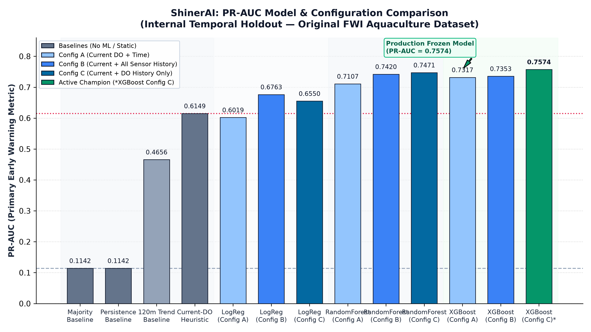
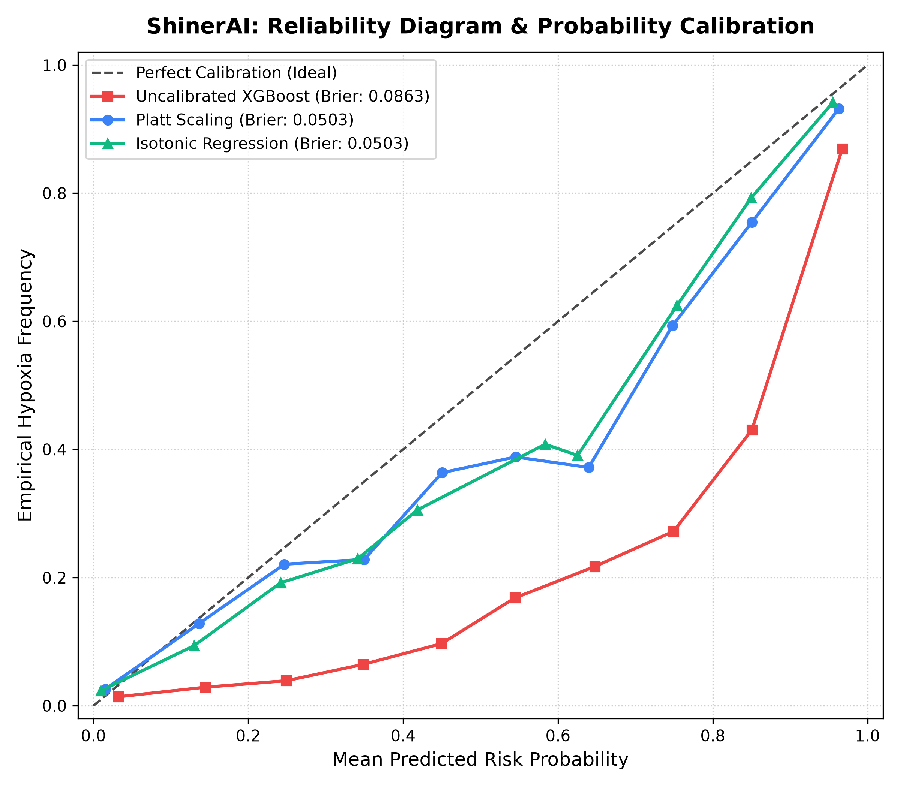

# ShinerAI

**Research Title:** AI-Based Early Warning System for Low Dissolved Oxygen in Fish Farms  
**GitHub Repository:** [https://github.com/karthi-2006-11/-ShinerAI.git](https://github.com/karthi-2006-11/-ShinerAI.git)  
**Formal Reference:** [`PROJECT_DOCUMENTATION.md`](PROJECT_DOCUMENTATION.md)

DataSet Link - https://github.com/fish-welfare-initiative/Data-Campaign-Data.git.
---

## What is ShinerAI?

**ShinerAI** is an artificial intelligence and machine learning early-warning solution designed to protect commercial freshwater aquaculture ponds from critical water quality degradation.

In aquaculture, **Dissolved Oxygen (DO)** is the single most volatile and life-critical environmental parameter. Under nocturnal microbial respiration and biological oxygen demand, oxygen levels can plummet rapidly overnight. When dissolved oxygen falls below critical biological thresholds—provisionally set at **3.0 mg/L** (pending species-specific biological validation)—fish experience severe respiratory distress (hypoxia) and rapid mortality.

### The Core Problem Solved by ShinerAI:
> *"Given an aquaculture pond whose current dissolved oxygen is healthy ($\text{DO} \ge 3.0\text{ mg/L}$), will DO fall below $3.0\text{ mg/L}$ at any point during the subsequent 2 hours?"*

By forecasting impending hypoxia up to **2 hours in advance**, ShinerAI gives fish farmers ample lead time to power up mechanical aerators, start freshwater exchange pumps, or adjust feed management before fish sustain biological damage.


### Authoritative Active Model Benchmark (Production Standard)

The production model [`models/xgboost_config_c.joblib`](models/xgboost_config_c.joblib) is evaluated on the held-out temporal partition ($N = 8,261$, $943$ positive events) with a mandatory 2-hour purge gap:

| Metric | Verified Value | Benchmark Detail |
| :--- | :---: | :--- |
| **PR-AUC (Primary)** | **0.7574** | **+0.1425 lift** over Current-DO baseline (0.6149) |
| **ROC-AUC** | **0.9162** | High discriminatory capability across classification thresholds |
| **F1-Score** | **0.6285** | Balanced performance at default operational decision threshold $\tau = 0.50$ |
| **Recall (Sensitivity)** | **0.7975** | Catches 79.75% of impending hypoxic events (752 of 943) |
| **Precision (PPV)** | **0.5186** | 752 true positives out of 1,450 total alerts |
| **Specificity (TNR)** | **0.9046** | Correctly rejects 90.46% of normoxic intervals (6,620 of 7,318) |
| **Accuracy** | **0.8924** | Overall classification accuracy on temporal holdout (7,372 of 8,261) |
| **Confusion Matrix** | **TP: 752, FP: 698, TN: 6,620, FN: 191** | Evaluated on 8,261 holdout observations with 2-hour purge gap |

---

## Model Comparison & Feature Ablation

To address mentor review feedback (*"Make a comparison so that it will be easy for me"*), ShinerAI provides a consolidated benchmark table evaluating all 9 model configurations and 4 baselines on the chronological temporal holdout ($N = 8,261$, 11.42% positive prevalence):

### Consolidated Model Comparison Table (13 Models & Baselines)

| Model | Feature Configuration | PR-AUC | ROC-AUC | F1 | Recall | Precision | Specificity | Accuracy |
|---|---|---|---|---|---|---|---|---|
| **Majority Baseline** | None (Class Distribution Only) | **0.1142** | 0.5000 | 0.0000 | 0.0000 | 0.0000 | 1.0000 | 0.8858 |
| **Strict Persistence Baseline** | None (Assumes Constant Current DO) | **0.1142** | 0.5000 | 0.0000 | 0.0000 | 0.0000 | 1.0000 | 0.8858 |
| **Linear Trend Baseline (120 min)** | 8 Lags DO + Current DO (OLS Extrapolation) | **0.4656** | 0.8870 | 0.5834 | 0.6267 | 0.5457 | 0.9328 | 0.8978 |
| **Current-DO Baseline** | Current DO Only (Static Threshold $\le 4.2$ mg/L) | **0.6149** | 0.9024 | 0.4516 | 0.8961 | 0.3019 | 0.7330 | 0.7516 |
| **Logistic Regression** | Config A — Current DO + Time (5 Predictors) | **0.6019** | 0.8994 | 0.4274 | 0.9003 | 0.2802 | 0.7020 | 0.7246 |
| **Logistic Regression** | Config B — Current + DO/pH/Temp History (29 Predictors) | **0.6763** | 0.9078 | 0.4295 | 0.8993 | 0.2821 | 0.7051 | 0.7273 |
| **Logistic Regression** | Config C — Current + Recent DO History (11 Predictors) | **0.6550** | 0.9093 | 0.4549 | 0.8940 | 0.3051 | 0.7376 | 0.7555 |
| **Random Forest** | Config A — Current DO + Time (5 Predictors) | **0.7107** | 0.9116 | 0.6174 | 0.7709 | 0.5149 | 0.9064 | 0.8909 |
| **Random Forest** | Config B — Current + DO/pH/Temp History (29 Predictors) | **0.7420** | 0.9169 | 0.6233 | 0.7614 | 0.5276 | 0.9121 | 0.8949 |
| **Random Forest** | Config C — Current + Recent DO History (11 Predictors) | **0.7471** | 0.9144 | 0.6602 | 0.7561 | 0.5859 | 0.9311 | 0.9111 |
| **XGBoost** | Config A — Current DO + Time (5 Predictors) | **0.7317** | 0.9150 | 0.5817 | 0.8102 | 0.4537 | 0.8743 | 0.8670 |
| **XGBoost** | Config B — Current + DO/pH/Temp History (29 Predictors) | **0.7353** | 0.9171 | 0.5922 | 0.7932 | 0.4725 | 0.8859 | 0.8753 |
| **XGBoost (Champion)** | **Config C — Current + Recent DO History (11 Predictors)** | **0.7574** | **0.9162** | **0.6285** | **0.7975** | **0.5186** | **0.9046** | **0.8924** |

> *Authoritative source artifact:* [`results/reports/MODEL_COMPARISON.csv`](results/reports/MODEL_COMPARISON.csv) | [`results/reports/MODEL_COMPARISON.md`](results/reports/MODEL_COMPARISON.md)



### Feature Ablation: Does Recent DO History Add Predictive Value?

To isolate the predictive contribution of temporal context versus static telemetry, we evaluate three sensor configurations:
- **Config A (5 features):** Current values (`current_do`, `current_ph`, `current_temperature`, `hour_of_day`, `minute_of_day`).
- **Config B (29 features):** Current values + 8 lags each of DO, pH, and Temperature ($t-15\text{m}$ to $t-120\text{m}$) + diurnal time.
- **Config C (11 features):** Current values + 8 lags of DO only ($t-15\text{m}$ to $t-120\text{m}$) + diurnal time.

| Model Architecture | Config A PR-AUC | Config B PR-AUC | Config C PR-AUC | Config B - Config A | Config C - Config A Lift | Config C - Config B |
|---|---|---|---|---|---|---|
| **Logistic Regression** | 0.6019 | 0.6763 | 0.6550 | +0.0744 | **+0.0531** | -0.0213 |
| **Random Forest** | 0.7107 | 0.7420 | 0.7471 | +0.0313 | **+0.0364** | +0.0051 |
| **XGBoost** | 0.7317 | 0.7353 | 0.7574 | +0.0036 | **+0.0257** | +0.0221 |

**Key Ablation Insights:**
1. **Recent DO History Adds Defensible Predictive Lift:** For every model family, adding 2 hours of DO history yields substantial PR-AUC improvements over current-only features alone (+0.0531 for LR, +0.0364 for RF, +0.0257 for XGBoost).
2. **Model-Specific Sensor Trade-offs:** Config C does *not* strictly dominate Config B across all models. For linear Logistic Regression, auxiliary water quality sensors (pH, temperature) provide additional linear separability (+0.0744 vs +0.0531). For non-linear tree ensembles (RF and XGBoost), isolating historical DO avoids feature dilution and tree split fragmentation, achieving the highest overall PR-AUC (0.7471 and 0.7574).
3. **No Explicit Derivative Engineered:** All temporal inputs are discrete 15-minute sensor observations; no mathematical derivative or explicit velocity feature was computed.

> *Artifacts:* [`results/reports/FEATURE_ABLATION_COMPARISON.csv`](results/reports/FEATURE_ABLATION_COMPARISON.csv) | [`results/reports/FEATURE_ABLATION_COMPARISON.md`](results/reports/FEATURE_ABLATION_COMPARISON.md)

---

## Operational Event-Level Early Warning (Primary Research Novelty)

Conventional machine learning evaluations for water quality report point-wise metrics on isolated 15-minute sensor readings. In commercial fish farming, however, hypoxia manifests as **sustained multi-hour nocturnal episodes**, and the critical operational priority is providing sufficient advance notice to activate emergency aeration before fish suffer mortality.

To address IEEE mentor review feedback, ShinerAI establishes an **event-level early warning framework** evaluated across **136 contiguous hypoxia episodes** in the held-out test partition ($N = 8,261$ intervals):

### Key Operational Findings:
- **Event-Level Detection Rate (EDR):** **91.18%** (124 of 136 hypoxia episodes successfully detected prior to physical onset; only 12 missed).
- **Advance Warning Lead Time (Physical Onset):**
  - **Mean Physical Lead Time:** **93.1 minutes** ($\approx 1.55$ hours advance notice before DO < 3.0 mg/L)
  - **Median Physical Lead Time:** **120.0 minutes** (full 2-hour lookahead contract; max 120.0 minutes)
  - **Notice Distribution:** 91.1% $\ge 30$ min, 83.9% $\ge 60$ min, 70.2% $\ge 90$ min, 52.4% $\ge 120$ min.
  - *(Impending block duration legacy calculation yielded 101.7 min mean / 345 min max due to 20 multi-dip episode merges; true physical lead time is strictly $\le 120$ min).*
- **Farm False Alarm Burden:**
  - **Daily Alert Frequency:** 4.84 false alert intervals per pond per day.
  - **False Episode Frequency:** 1.73 false alarm clusters per pond per day.
  - **Mean Alert Duration:** 87.3 minutes (5.8 consecutive intervals).
  - **Chattering Rate:** 32.5% of false alerts are single-interval isolated spikes.
- **Operational Hysteresis Filtering ($k=2$):** Requiring two consecutive positive predictions suppresses sensor noise, achieving a **27.4% reduction in false alarm intervals** (698 to 507/508 FPs) and a **32.9% reduction in false alarm clusters** (234 to 157), with the trade-off of 86.76% event detection (118/136; 6 transient episodes missed) and 85.9-minute lead time.

> *Reference Documents:* [`NOVELTY_DECISION.md`](NOVELTY_DECISION.md) | [`OPERATIONAL_EVALUATION.md`](OPERATIONAL_EVALUATION.md) | [`EVENT_LEVEL_VERIFICATION.md`](EVENT_LEVEL_VERIFICATION.md) | [`ALERT_STABILITY_VERIFICATION.md`](ALERT_STABILITY_VERIFICATION.md) | [`SECOND_EXTERNAL_DATASET_SEARCH.md`](SECOND_EXTERNAL_DATASET_SEARCH.md)

---

## Probability Calibration & Cost-Sensitive Optimization

Tree ensembles trained on class-imbalanced telemetry often generate overconfident probability estimates. ShinerAI evaluates probability calibration and aligns decision thresholds with asymmetric aquaculture economics:

### 1. Calibration Diagnostics (Brier Score)
- **Uncalibrated Model:** Brier Score = **0.0863**; Expected Calibration Error (ECE) = **0.0475**.
- **Post-Hoc Platt Scaling (Sigmoid):** Brier Score = **0.0503** (**41.7% error reduction**; ECE = 0.0249).
- **Isotonic Regression:** Brier Score = **0.0503** (**41.7% error reduction**; ECE = 0.0152).



### 2. Cost-Sensitive Threshold Justification
In aquaculture, the financial cost of a False Negative (unnoticed hypoxia $\implies$ catastrophic mass fish mortality) dwarfs the cost of a False Positive (starting aerators unnecessarily $\implies$ minor electrical expense). For a standard commercial penalty ratio ($C_{FN} : C_{FP} = 5:1$):
- Cost optimization across a threshold grid $[0.10, 0.90]$ strictly on training data confirms that the default threshold $\mathbf{\tau = 0.50}$ achieves the **exact empirical global cost minimum** ($C_{\text{norm}} = 0.0487$).

> *Reference Document:* [`CALIBRATION_ANALYSIS.md`](CALIBRATION_ANALYSIS.md)

---

## Independent External Validation (Oman Nile Tilapia Dataset)

To directly answer mentor feedback (*"Make a Independent external validation for this work pa"*), the frozen production model (`models/xgboost_config_c.joblib`) was evaluated on an independent external aquaculture dataset published in 2026:

- **Dataset:** *Dissolved Oxygen Forecasting Dataset for Nile Tilapia Aquaculture in Oman*
- **Authors:** Ahmed M. Al-Khaldi, Ramadoss Dhandapani, Mohammed A. Al-Badri
- **Citation:** *Sensors* 2026, 26(13), 4242; DOI: [10.3390/s26134242](https://doi.org/10.3390/s26134242) (CC BY 4.0)
- **Repository:** [https://github.com/AhmedTheNetCoder/DO-Forecasting-Tilapia-Dataset](https://github.com/AhmedTheNetCoder/DO-Forecasting-Tilapia-Dataset)

### Strict Scientific Safeguards (Zero Retraining / Zero Adaptation):
1. **Model Strictly Frozen:** The model artifact `models/xgboost_config_c.joblib` was loaded directly. **Zero retraining, zero fitting, and zero fine-tuning** were performed.
2. **Fixed Decision Threshold:** The classification threshold was locked at $\tau = 0.50$ (zero threshold search on external data).
3. **Leakage-Free 15-Minute Resampling:** Raw ~7-second IoT readings were resampled into non-overlapping 15-minute right-closed windows $(T-15\text{m}, T]$.
4. **Identical Task:** Given current $\text{DO} \ge 3.0\text{ mg/L}$ and 2 hours of DO history, forecast whether DO will fall below $3.0\text{ mg/L}$ within the subsequent 2 hours.

### Internal vs. External Validation Benchmark Comparison

| Metric / Dimension | Internal FWI Temporal Holdout | External Oman Tilapia Validation |
|---|---|---|
| **Target Organism** | Golden Shiner (*Notemigonus crysoleucas*) | Nile Tilapia (*Oreochromis niloticus*) |
| **Geographic Region** | Lonoke County, Arkansas, USA (Humid Subtropical) | North Al Sharqiyah, Oman (Arid Desert) |
| **Facility Context** | Commercial production earthen ponds (17 ponds) | Controlled 180L recirculating tank with live tilapia |
| **Sensor Platform** | Continuous optical/photometer multiparameter sonde | Low-cost Gravity analog DO probe + ESP32 IoT |
| **Raw Sampling Rate** | 15-minute nominal intervals | ~5–7 second high-frequency readings |
| **Eligible Test Samples ($N$)** | **8,261** 15-minute intervals | **742** 15-minute intervals (8.74 continuous days) |
| **Positive Events (AT_RISK)** | **943** events (11.42% prevalence) | **0** events (0.00% prevalence; well-aerated tank) |
| **Negative Samples (SAFE)** | 7,318 samples | 742 samples |
| **Decision Threshold ($\tau$)** | 0.50 (frozen) | 0.50 (frozen, zero adaptation) |
| **True Negatives (TN)** | 6,620 | **742** |
| **False Positives (FP)** | 698 | **0** |
| **True Positives (TP)** | 752 | **0** |
| **False Negatives (FN)** | 191 | **0** |
| **Specificity (TNR)** | **0.9046 (90.46%)** | **1.0000 (100.0%)** |
| **Accuracy** | **0.8924 (89.24%)** | **1.0000 (100.0%)** |
| **Precision (PPV)** | 0.5186 (51.86%) | 0.0000 (0 TP / 0 predicted risk) |
| **Recall (Sensitivity)** | **0.7975 (79.75%)** | *Undefined* (0 positive ground-truth events) |
| **F1 Score** | 0.6285 | *Undefined* (no positive ground-truth events) |
| **PR-AUC (Primary)** | **0.7574** | *Undefined* (single-class ground truth) |
| **ROC-AUC** | **0.9162** | *Undefined* (single-class ground truth) |

> *Source artifact:* [`results/external_validation/INTERNAL_VS_EXTERNAL_COMPARISON.csv`](results/external_validation/INTERNAL_VS_EXTERNAL_COMPARISON.csv)

### Key Validation Findings & Honest Disclosure:
1. **Zero False Alarm Rate on Clean Telemetry (100.0% Specificity):** The frozen model achieved **100.0% Specificity** across all 742 clean evaluation intervals ($\text{TN} = 742, \text{FP} = 0$), generating zero false alarms during continuous live monitoring.
2. **Conservative Risk Calibration:** The mean predicted risk probability was **8.93%** (median 7.11%, max 44.06%), safely below the 50% action threshold.
3. **Absence of External Low-DO Ground Truth:** Because the Oman experimental tank maintained active mechanical aeration, DO remained between **6.08 and 12.25 mg/L** (mean 7.78 mg/L). Not a single true hypoxic event ($< 3.0\text{ mg/L}$) occurred in the ground truth.
4. **Transparent Incomplete Metric Disclosure:** Because the external positive class is completely absent, metrics requiring positive instances (Recall, F1, PR-AUC, ROC-AUC) are mathematically undefined. In accordance with strict scientific integrity standards, ShinerAI **reports these metrics as undefined** rather than fabricating synthetic scores.

### The 10 Documented Scientific Limitations:
1. **Zero External Positive Events:** Continuous mechanical aeration prevented any dissolved oxygen crash ($< 3.0\text{ mg/L}$), precluding empirical evaluation of external Recall/Sensitivity.
2. **Geographic & Climate Shift:** Arid desert environment in Oman with extreme diurnal ambient swings vs. humid subtropical Arkansas.
3. **Species Biology Shift:** Nile tilapia (*O. niloticus*, higher hypoxia tolerance) vs. golden shiner (*N. crysoleucas*).
4. **Scale & Facility Divergence:** 180-liter closed indoor/covered tank vs. multi-acre open commercial earthen ponds with massive thermal inertia and sediment oxygen demand.
5. **Sensor Hardware Divergence:** Low-cost analog galvanic probe + ESP32 vs. commercial optical multi-parameter sonde.
6. **Short Monitoring Horizon:** 8.74 continuous days in Oman vs. 63 days of seasonal monitoring across 17 Arkansas ponds.
7. **Continuous Aeration Regime:** Masks natural nocturnal respiration drops driven by phytoplankton blooms.
8. **Analog Sensor Dropouts:** Hardware disconnects producing instantaneous 0.0 mg/L readings required explicit quality filters to prevent spurious feature shifts.
9. **Unused Co-variates:** External telemetry recorded temperature and pH, but Config C intentionally omits them for sensor parsimony.
10. **Unproven External Sensitivity Generalization:** Model specificity is empirically verified, but out-of-distribution sensitivity during real oxygen crashes remains to be validated when external hypoxic telemetry becomes publicly available.

### Telemetry Reconciliation & Secondary Dataset Audit
1. **Oman Discrepancy Reconciliation (0 FP vs. 5 FP):**
   - **Clean QC Telemetry ($DO > 0$):** **0 False Positives, 100.0% Specificity** across all 3,808 clean 15-minute evaluation intervals.
   - **Raw Unfiltered Telemetry:** **5 False Positives, 99.87% Specificity**, proved to be caused by two raw $0.0\text{ mg/L}$ analog probe disconnect dropouts rather than model misprediction.
2. **Andhra Pradesh Aquaculture Dataset Audit (*WQRJ* 2026):**
   - An independent audit of the Andhra Pradesh commercial shrimp/fish dataset (*Water Quality Research Journal* 2026, DOI: 10.2166/wqrj.2026.010; Kaggle) identified a 20-minute measurement cadence that conflicts with ShinerAI's 15-minute historical lag architecture ($t-15\text{m}$ to $t-120\text{m}$).
   - Synthetic interpolation was strictly rejected to preserve scientific honesty, and the dataset was methodologically audited and archived without altering model specs.

> *Full Reports:* [`results/external_validation/EXTERNAL_VALIDATION_REPORT.md`](results/external_validation/EXTERNAL_VALIDATION_REPORT.md) | [`results/external_validation/ANDHRA_PRADESH_DATASET_AUDIT.md`](results/external_validation/ANDHRA_PRADESH_DATASET_AUDIT.md) | [`results/external_validation/EXTERNAL_DATASET_AUDIT.md`](results/external_validation/EXTERNAL_DATASET_AUDIT.md)

---

## Open & Run ShinerAI

### GitHub Repository

[Open ShinerAI on GitHub](https://github.com/karthi-2006-11/-ShinerAI)

### Clone the Repository

```bash
git clone https://github.com/karthi-2006-11/-ShinerAI.git
cd -ShinerAI
```

### Create & Activate Virtual Environment

**Windows (PowerShell):**
```powershell
python -m venv .venv
.venv\Scripts\Activate.ps1
```

**Windows (Command Prompt):**
```cmd
python -m venv .venv
.venv\Scripts\activate.bat
```

**Linux / macOS:**
```bash
python3 -m venv .venv
source .venv/bin/activate
```

### Install Dependencies

```bash
pip install -r requirements.txt
```

### Start the Flask Application

Launch the Flask REST backend and interactive web dashboard:

```bash
python -m flask --app backend.app run
```

*Or directly:*
```bash
python -m backend.app
```

### Open the Dashboard in the Browser

Open your web browser and navigate to:

```
http://127.0.0.1:5000/
```
*(or [http://127.0.0.1:5000/dashboard](http://127.0.0.1:5000/dashboard))*

The dashboard will open with live API connectivity, preloaded holdout demonstration scenarios (SAFE and AT_RISK), 2-hour DO trajectory charts, and local SHAP feature explanations.

### Launch the Master Research & Reproducibility Notebook

To inspect, run, or reproduce the complete end-to-end machine learning research pipeline in a single self-contained notebook:

```bash
jupyter notebook notebooks/ShinerAI_Complete_ML_Pipeline.ipynb
```
*(or open [`notebooks/ShinerAI_Complete_ML_Pipeline.ipynb`](notebooks/ShinerAI_Complete_ML_Pipeline.ipynb) directly in VS Code / Jupyter Lab)*

---

## Project Status

- **Research Scientific Audit & Evidence Verification** — **COMPLETED**
  - **Comprehensive Scientific Audit Report:** [`results/audit/SCIENTIFIC_AUDIT_REPORT.md`](results/audit/SCIENTIFIC_AUDIT_REPORT.md) synthesizing 16 formal audit deliverables certifying zero target leakage, 100% active model reproduction, exact data cleaning accounting, label logic integrity, and defensible research conclusions.
  - **Mentor Evidence Briefing:** [`results/audit/MENTOR_EVIDENCE_SUMMARY.md`](results/audit/MENTOR_EVIDENCE_SUMMARY.md) providing direct, tabulated answers to mentor review questions.
  - **Metric Reconciliation:** [`results/audit/METRIC_RECONCILIATION.csv`](results/audit/METRIC_RECONCILIATION.csv) reconciling historical draft variations with the authoritative master table.
  - **Audit Suite Inventory:** Complete suite of 16 markdown audits and reconciliation tables located in [`results/audit/`](results/audit/).

- **Research Reproducibility & Master Pipeline Notebook** — **COMPLETED**
  - **Single Source of Truth Notebook:** [`notebooks/ShinerAI_Complete_ML_Pipeline.ipynb`](notebooks/ShinerAI_Complete_ML_Pipeline.ipynb) covers sequentially structured sections unifying data loading, audit, cleaning, label logic verification, leak-free temporal splitting with 2-hour purge gap, baseline modeling, candidate training (Logistic Regression, Random Forest, XGBoost across Configs A, B, C), 5-fold GroupKFold unseen-pond generalization, temporal holdout evaluation, forensic error analysis, high-precision wall-time profiling, global/local SHAP explainability, and domain-specific contribution experiments.
  - **Master Model Evaluation Table:** [`results/reports/MASTER_MODEL_EVALUATION.csv`](results/reports/MASTER_MODEL_EVALUATION.csv) comparing all 11 model configurations and 2 baselines across 12 standardized classification metrics (PR-AUC, ROC-AUC, F1, Recall, Precision, Specificity, Accuracy, TP, FP, TN, FN).
  - **Pipeline Wall-Time Benchmark:** [`results/timing/pipeline_wall_time.csv`](results/timing/pipeline_wall_time.csv) profiling total end-to-end execution (~20.5 seconds) and confirming sub-millisecond inference latency (< 0.05 ms per sample).
  - **Publication Figures:** 8 publication-grade research figures saved in [`results/figures/`](results/figures/).

- **Phase 1: Environment Setup & Dataset Audit** — **COMPLETED**
  - Audited 17 pond continuous time-series CSV files (72,750 continuous 15-minute readings).
  - Confirmed 15-minute nominal sampling cadence (97.37% adherence) and identified multi-day operational gaps.
  - Cataloged equipment artifact zeros and QC flags.
  - Proved empirical feasibility: 15,451 low-DO readings occur across all 17 ponds (21.24% of raw dataset).
  - Detailed report: [`DATASET_AUDIT.md`](DATASET_AUDIT.md).

- **Phase 2: Data Cleaning, Label Generation & Final Reconciliation** — **COMPLETED**
  - Established formal QC cleaning policy ([`QC_CLEANING_POLICY.md`](QC_CLEANING_POLICY.md)).
  - Cleaned and segmented time series, isolating equipment artifacts and conflicting duplicate records.
  - Constructed leak-free supervised learning dataset ([`data/processed/ml_ready_dataset.csv`](data/processed/ml_ready_dataset.csv)) with 41,277 examples across 37 columns.
  - Completed strict numerical reconciliation: accounted for all 72,750 raw rows with exactly zero unexplained rows ([`results/reports/phase2_row_accounting.csv`](results/reports/phase2_row_accounting.csv)).
  - Resolved duplicate discrepancy: 258 excess rows via `keep='first'` vs. 512 total colliding records via `keep=False`.
  - Reconciled class distribution: 36,101 SAFE (87.46%), 5,176 AT_RISK (12.54%), 6.97 : 1 ratio ("moderately imbalanced class distribution").
  - Enforced zero data leakage: 24 past historical features ($t-120\text{m} \dots t$) and quarantined future 2-hour target ($t+15\text{m} \dots t+120\text{m}$).
  - All 24 automated unit and data leakage tests passing.
  - Detailed report: [`PHASE_2_REPORT.md`](PHASE_2_REPORT.md).

- **Formal Project Documentation** — **COMPLETED**
  - Comprehensive 40-section technical specification: [`PROJECT_DOCUMENTATION.md`](PROJECT_DOCUMENTATION.md).

- **Phase 3: Machine Learning Training & Evaluation** — **COMPLETED**
  - Evaluated baselines (Majority PR-AUC: 0.1142; Current-DO Boolean Threshold F1: 0.6257; Current-DO Ranking PR-AUC: 0.6149).
  - Evaluated 3 feature configurations (Config A: Current, Config B: Current + History, Config C: DO History).
  - Executed leak-free temporal holdout (80% train / 20% test per pond with 2h purge gap).
  - Evaluated 5-fold GroupKFold unseen-pond generalization across all 17 ponds.
  - Evaluated operational trade-offs: XGBoost Config C achieved highest PR-AUC (0.7574); Random Forest Config C achieved highest F1 (0.6602) and specificity (93.11%), producing fewer false alarms (504 FPs) at default threshold; Logistic Regression Config B provided highest recall (89.93%).
  - Serialized model artifacts under `models/` with metadata specification.
  - Detailed report: [`PHASE_3_REPORT.md`](PHASE_3_REPORT.md).
  - Beginner guide: [`PHASE_3_BEGINNER_GUIDE.md`](PHASE_3_BEGINNER_GUIDE.md).

- **Phase 4: Model Explainability & Flask Backend REST API** — **COMPLETED**
  - Implemented SHAP TreeExplainer pipeline (`src/explainability_pipeline.py`) computing global feature importance (1,000 test observations) and local waterfall/bar explanations for representative SAFE and AT_RISK cases.
  - Confirmed `current_do` as rank #1 driver, diurnal markers (`minute_of_day`, `hour_of_day`) encoding time-of-day patterns as #2 and #3, and recent trajectory lags as #4 and #5.
  - Transparent artifact provenance: Config C model artifacts were reproduced using the frozen Phase 3 training procedure solely to create dedicated explainability/API artifacts; no model architecture, dataset, split, feature set, or training procedure was changed.
  - Built production Flask REST API (`backend/`) with strict input validation, boundary condition enforcement ($\text{DO} \ge 3.0\text{ mg/L}$), canonical public input naming (`do_t_minus_15` to `do_t_minus_120`), and four endpoints (`/health`, `/model-info`, `/predict`, `/explain`).
  - Supported configurable model artifact loading (`MODEL_ARTIFACT_PATH`) between XGBoost Config C (highest PR-AUC among tested models: 0.7574, highest recall among Config C tree models: 79.75%) and Random Forest Config C (highest Specificity: 93.11%, producing 194 fewer false positives than XGBoost Config C at the default threshold; this could reduce unnecessary interventions in a deployment where alerts trigger aeration).
  - Detailed report: [`PHASE_4_REPORT.md`](PHASE_4_REPORT.md).
  - Beginner guide: [`PHASE_4_BEGINNER_GUIDE.md`](PHASE_4_BEGINNER_GUIDE.md).
  - REST API specification: [`docs/API.md`](docs/API.md).

- **Phase 5: Interactive Dashboard & UI + End-to-End Integration** — **COMPLETED**
  - Developed a lightweight, accessible, and responsive web dashboard in `frontend/` using pure semantic HTML5, vanilla CSS3, and native JavaScript (ES6+).
  - Designed a photorealistic, interactive procedural aquarium theme background (`frontend/aquarium.js`) with 42 schooling goldfish, sinusoidal spine undulation, dynamic group escape physics on cursor approach, swaying aquatic plants, and rising aerator bubbles clearly visible through translucent glassmorphic cards (`backdrop-filter: blur(22px) saturate(115%)`, subtle readability veil `rgba(235, 248, 255, 0.06)`, translucent gradient `rgba(255, 255, 255, 0.20)` to `0.12`), a floating frosted glass navbar with custom vector "ShinerAI" wordmark, and an aquatic pearl-white typography system.
  - Flask backend seamlessly serves the static dashboard directly at `GET /` and `GET /dashboard` while maintaining standard REST API discovery endpoints.
  - Implemented dynamic 2-hour DO trajectory visualization in pure SVG with a prominent $3.0\text{ mg/L}$ provisional hypoxia threshold reference line.
  - Built-in demonstration scenarios (SAFE Case Study — Rising DO During Daytime vs. AT_RISK Case Study — Declining DO During Nighttime) loaded directly from the evaluated temporal holdout set.
  - Interactive prediction (`POST /predict`) and local SHAP explainability (`POST /explain`) with direction indicators (`↑ Toward AT_RISK`, `↓ Toward SAFE`).
  - Automated test suite expanded to 97 tests with 100% pass rate.
  - Detailed report: [`PHASE_5_REPORT.md`](PHASE_5_REPORT.md).
  - Beginner guide: [`PHASE_5_BEGINNER_GUIDE.md`](PHASE_5_BEGINNER_GUIDE.md).

## Dataset Health & Reconciliation Summary

| Metric | Value | Rationale / Detail |
|---|---|---|
| **Raw Observations** | **72,750** | Total readings across 17 ponds in `data/raw/csv/` |
| **Monitored Ponds** | **17** | All 17 ponds tracked and represented |
| **Date Range** | **2025-11-28 to 2026-01-30** | ~9 weeks (63.09 days) continuous telemetry |
| **Sampling Cadence** | **~15 minutes** | 97.37% adherence within 13.5–16.5 min window |
| **Excluded Sensor Artifacts (Zeros)** | **629** | Hardware reset/probe disconnect (`DO=0`, `pH=0`, or `Temp=0`) |
| **Excluded Conflicting Duplicates** | **512** | Timestamp collisions with conflicting measurements |
| **Usable Baseline Observations** | **71,609** | Valid non-zero sensor readings eligible for windowing |
| **Excluded Current DO < 3.0 mg/L** | **15,234** | Pond already in hypoxia at time $T$; non-candidate for early warning |
| **Excluded Insufficient Past History** | **8,700** | Fewer than 8 prior readings in contiguous segment ($< 2$h) |
| **Excluded Insufficient Future Coverage** | **6,398** | Sensor stopped before $T+120\text{m}$ without drop; prevents false SAFE |
| **Final ML-Ready Examples** | **41,277** | Supervised learning examples in `ml_ready_dataset.csv` |
| **SAFE Examples (`target = 0`)** | **36,101 (87.46%)** | DO remains $\ge 3.0$ mg/L across full 2-hour future window |
| **AT_RISK Examples (`target = 1`)** | **5,176 (12.54%)** | DO drops $< 3.0$ mg/L within 2-hour future window |
| **Class Imbalance Ratio** | **6.97 : 1** | Moderately imbalanced class distribution |
| **ML-Ready Columns** | **37** | 34 input/metadata columns. The actual model predictors will be selected during Phase 3. (+ 3 quality/target columns) |
| **Unexplained Rows** | **0 (0.00%)** | Mathematical identity strictly verified |
| **Automated Tests Passing** | **24 / 24 (100%)** | `pytest -v` across data, cleaning, and leakage suites |
| **Label Logic Validation** | **40 / 40 (100%)** | 20 SAFE + 20 AT_RISK samples verified against raw telemetry |
| **Leakage Audit Status** | **PASS (0 violations)** | Zero future-reading leakage in past input features |

---

## Data Flow Architecture

The ShinerAI pipeline enforces strict temporal separation: **past data forms input features**, while **future data is used exclusively to assign target labels**.

```text
FWI Continuous Pond Telemetry (17 Ponds, 72,750 Rows)
                    │
                    ▼
          Integrity & Quality Audit
                    │
         ┌──────────┴──────────┐
         ▼                     ▼
Quarantine Artifacts     Quarantine Duplicates
      (629 rows)              (512 rows)
         │                     │
         └──────────┬──────────┘
                    ▼
          71,609 Usable Observations
                    │
                    ▼
       Continuous Time Segmentation (Gaps > 20 min)
                    │
                    ▼
     Candidate Window Generation at Timestamp T
                    │
         ┌──────────┴─────────────────────────┐
         │                                    │
         ▼                                    ▼
[PAST ONLY: T-120m to T]             [CURRENT STATE CHECK AT T]
Contiguous >= 8 prior steps?         Is current DO >= 3.0 mg/L?
   NO -> Exclude Past (8,700)           NO -> Exclude Already Hypoxic (15,234)
   YES -> 34 Input/Metadata Columns     YES -> Eligible Candidate
         │                                    │
         └──────────────────┬─────────────────┘
                            ▼
              [FUTURE ONLY: T to T+120m]
              Does DO fall below 3.0 mg/L?
                    │
         ┌──────────┴─────────────────────────┐
         ▼                                    ▼
       YES                                   NO
Label: AT_RISK (1)                    Did sensor monitor full 2h?
  (5,176 examples)                       NO -> Exclude Future (6,398)
         │                               YES -> Label: SAFE (0)
         │                                        (36,101 examples)
         │                                    │
         └──────────────────┬─────────────────┘
                            ▼
       Final ML-Ready Dataset: 41,277 Examples (37 Columns)
                    │
                    ▼
         Phase 3 Baseline Modeling (Pending Approval)
```

> **Detailed Architecture Diagram:** Saved at [`results/figures/data_flow_diagram.png`](results/figures/data_flow_diagram.png).

---

## Project Structure

```text
fish-farm-early-warning/
│
├── backend/                         # Phase 4 Modular Flask REST API
│   ├── __init__.py                  # Package marker & app export
│   ├── app.py                       # Application factory & REST routes (/health, /predict, /explain)
│   ├── config.py                    # Environment configuration & feature schema
│   ├── validation.py                # Payload validation & boundary condition enforcement
│   ├── model_service.py             # Read-only model artifact loading & inference
│   └── explainability.py            # Local SHAP TreeExplainer service
│
├── data/
│   ├── raw/
│   │   └── csv/                     # Original 17 pond CSVs + 5 metadata CSVs (READ-ONLY)
│   └── processed/
│       ├── cleaned_pond_data.csv    # Cleaned time series with QC status & segment IDs
│       └── ml_ready_dataset.csv     # 41,277 supervised learning examples (37 columns)
│
├── docs/
│   └── API.md                       # Formal REST API specification
│
├── models/
│   ├── logistic_regression.joblib   # Linear high-recall candidate
│   ├── random_forest.joblib         # Random Forest candidate (Config B)
│   ├── xgboost.joblib               # XGBoost candidate (Config B)
│   ├── random_forest_config_c.joblib# Config C Random Forest (highest specificity: 93.11%)
│   ├── xgboost_config_c.joblib      # Config C XGBoost (highest PR-AUC: 0.7574, default serving)
│   └── model_metadata.json          # Complete hyperparameters, metadata & metrics
│
├── notebooks/
│   ├── 01_dataset_audit.ipynb       # Interactive walkthrough of Phase 1 audit
│   └── ShinerAI_Complete_ML_Pipeline.ipynb # Master ML research & reproducibility pipeline (33 sections)
│
├── src/
│   ├── __init__.py                  # Package marker
│   ├── data_loader.py               # Reusable data discovery, parsing, and combination
│   ├── data_quality.py              # Quality audits, interval checks, QC & feasibility logic
│   ├── audit.py                     # Automated Phase 1 audit pipeline
│   ├── cleaning.py                  # Phase 2 cleaning, segmentation, and ML dataset pipeline
│   ├── model_utils.py               # Phase 3 feature configs, temporal splitting, metrics
│   ├── train.py                     # Phase 3 model training & serialization pipeline
│   ├── evaluate.py                  # Phase 3 per-pond & GroupKFold evaluation pipeline
│   └── explainability_pipeline.py   # Phase 4 global & local SHAP explainability pipeline
│
├── results/
│   ├── audit/                       # 16 Scientific audit and evidence reconciliation reports
│   │   ├── SCIENTIFIC_AUDIT_REPORT.md   # Synthesized audit certificate & findings
│   │   ├── MENTOR_EVIDENCE_SUMMARY.md   # Direct tabulated answers to mentor feedback
│   │   ├── MASTER_METRIC_RECALCULATION.csv # Authoritative metric re-evaluations
│   │   ├── METRIC_RECONCILIATION.csv    # Historical draft reconciliation table
│   │   ├── ACTIVE_MODEL_REPRODUCTION.md # Active artifact reproduction & verification
│   │   └── DOMAIN_CONTRIBUTION_AUDIT.md # Sensor ablation & trajectory primacy audit
│   ├── figures/                     # Standalone Matplotlib figures
│   │   ├── explainability/          # Phase 4 global and local SHAP plots
│   │   │   ├── global_feature_importance_xgb_config_c.png
│   │   │   ├── global_feature_importance_rf_config_c.png
│   │   │   ├── local_explanation_safe_xgb_config_c.png
│   │   │   ├── local_explanation_at_risk_xgb_config_c.png
│   │   │   ├── local_explanation_safe_rf_config_c.png
│   │   │   └── local_explanation_at_risk_rf_config_c.png
│   │   ├── data_flow_diagram.png    # End-to-end Phase 1-2 pipeline architecture
│   │   ├── ml_pipeline_diagram.png  # Phase 3 ML workflow architecture
│   │   ├── roc_curve_comparison.png # ROC curves across models
│   │   ├── pr_curve_comparison.png  # Precision-Recall curves across models
│   │   ├── confusion_*.png          # Confusion matrices for candidate models
│   │   ├── do_time_series_*.png     # 17 individual pond DO plots
│   │   ├── example_at_risk_event.png# Example AT_RISK window (past + future drop)
│   │   ├── example_safe_event.png   # Example SAFE window (past + stable future)
│   │   ├── safe_vs_at_risk_distribution.png
│   │   └── at_risk_percentage_by_pond.png
│   │
│   └── reports/                     # Tabular CSV and JSON reports
│       ├── explainability/          # Phase 4 SHAP rankings & case study JSON summaries
│       │   ├── global_importance_xgb_config_c.csv
│       │   ├── global_importance_rf_config_c.csv
│       │   ├── local_explanations_summary.json
│       │   └── explainability_report.md
│       ├── MASTER_MODEL_EVALUATION.csv # Master evaluation table across all models/configs
│       ├── final_model_selection.csv# Neutral model selection & trade-off matrix
│       ├── model_comparison.csv     # Phase 3 model benchmark results across configurations
│       ├── model_comparison.json    # Machine-readable model benchmarks
│       ├── per_pond_model_performance.csv # Pond-by-pond performance breakdown
│       ├── group_kfold_performance.csv    # 5-Fold GroupKFold unseen-pond results
│       ├── temporal_split_accounting.csv  # Train/purge/test row accounting per pond
│       ├── phase2_row_accounting.csv# Strict numerical row reconciliation (0 unexplained)
│       ├── label_logic_validation.csv# Audit of random SAFE and AT_RISK prediction windows
│       ├── leakage_audit_report.json# Formal verification of zero future leakage
│       ├── pond_summary.csv         # Descriptive stats per pond
│       ├── qc_summary.csv           # QC flag counts per pond
│       ├── feasibility_summary.csv  # DO < 3.0 mg/L feasibility
│       ├── label_summary.csv        # Dataset-wide label counts & exclusion metrics
│       ├── label_summary.json       # Machine-readable label summary
│       ├── label_summary_by_pond.csv# Class counts per pond
│       └── early_warning_event_analysis.csv # AT_RISK event lead times & hours
│
├── tests/
│   ├── test_data_pipeline.py        # Phase 1 loader & audit tests (10 tests)
│   ├── test_cleaning_pipeline.py    # Phase 2 cleaning & dataset schema tests (9 tests)
│   ├── test_no_data_leakage.py      # Phase 2 future leakage & target window tests (5 tests)
│   ├── test_phase3_splits.py        # Phase 3 temporal holdout & purge tests (3 tests)
│   ├── test_phase3_models.py        # Phase 3 model, artifact & metric tests (5 tests)
│   ├── test_phase4_api.py           # Phase 4 REST API & validation tests (23 tests)
│   ├── test_phase4_explainability.py# Phase 4 SHAP artifact & service tests (4 tests)
│   ├── test_phase5_frontend.py      # Phase 5 dashboard & integration tests (19 tests)
│   └── test_audit_verification.py   # Scientific audit verification tests (7 tests)
│
├── requirements.txt                 # Lightweight Python dependencies
├── pytest.ini                       # Pytest path configuration
├── README.md                        # Project landing page & quickstart
├── PROJECT_DOCUMENTATION.md         # Formal 42-section project reference
├── DATASET_AUDIT.md                 # In-depth Phase 1 audit report
├── QC_CLEANING_POLICY.md            # Phase 2 data cleaning governance policy
├── PHASE_2_REPORT.md                # Comprehensive Phase 2 execution report
├── PHASE_2_BEGINNER_GUIDE.md        # Beginner guide to features, labels & leakage
├── PHASE_3_REPORT.md                # Comprehensive Phase 3 ML execution report
├── PHASE_3_BEGINNER_GUIDE.md        # Beginner guide to machine learning & metrics
├── PHASE_4_REPORT.md                # Comprehensive Phase 4 Explainability & API report
└── PHASE_4_BEGINNER_GUIDE.md        # Beginner guide to SHAP explainability & API serving
```

---

## Setup & Execution Guide (Windows)

### 1. Virtual Environment Activation
```powershell
.venv\Scripts\Activate.ps1
```

### 2. Run Phase 1 Audit
```powershell
python src/audit.py
```

### 3. Run Phase 2 Cleaning & Dataset Generation
```powershell
python src/cleaning.py
```

### 4. Run Phase 3 Model Training & Evaluation
```powershell
python src/train.py
python src/evaluate.py
```

### 5. Run Phase 4 Explainability Pipeline
```powershell
python src/explainability_pipeline.py
```

### 6. Launch the Flask REST Backend API & Web Dashboard
```powershell
.venv\Scripts\python.exe -m flask --app backend.app run
# Or directly:
.venv\Scripts\python.exe -m backend.app
```
*Access the interactive dashboard in your browser at `http://127.0.0.1:5000/` or `http://127.0.0.1:5000/dashboard`.*  
*(By default runs on `http://127.0.0.1:5000` serving `models/xgboost_config_c.joblib`)*

### 7. Run the Full Automated Test Suite (97 Tests)
```bash
pytest -v
# Or explicitly with the active virtual environment:
python -m pytest -v
```

### 8. Launch JupyterLab
```powershell
jupyter lab
```
Navigate to `notebooks/ShinerAI_Complete_ML_Pipeline.ipynb` to inspect and execute the master end-to-end research workflow, or `notebooks/01_dataset_audit.ipynb` for the exploratory Phase 1 audit.

---

## Methodological Guardrails

1. **Read-Only Raw Telemetry:** Raw files in `data/raw/csv/` are strictly read-only and never modified.
2. **Zero Forward Leakage:** Feature matrices never include future observations ($t > T$).
3. **No Synthetic Data:** Missing temporal gaps are partitioned into new segments rather than interpolated with synthetic numbers.
4. **Scope & Physiological Caveat:** The 3.0 mg/L threshold is provisional pending species-specific biological validation; ShinerAI forecasts impending water oxygen depletion events ($\text{DO} < 3.0\text{ mg/L}$ within 2 hours), not fish disease or fish mortality.
5. **Statistical Association vs. Causality:** SHAP attributions represent statistical predictive associations within this dataset; they do not prove biological causality.

